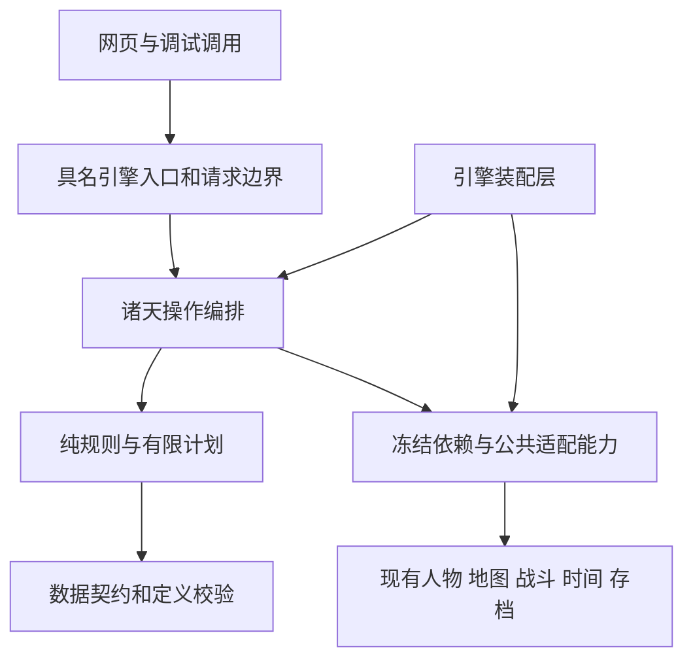

# 诸天系统策划案：修行、诸界联系与跨界战争

> 实装状态（2026-10-06）：M0、M1 已落地，M2 已完成四界求证、和平协作与两个异象的首个闭环。第三层的四个最高界面——仙界、修罗界、幽冥界、轮回界——均已接入本地调查、合作、参悟、维护及校订旧录；人界穆陵沙漠的镜律场域支持低耗破解、材料隔断、真实强攻与持久重访；无棣原的因果遗址已支持读取、唯一阵芯取用／替换／归还、关联阵眼通信和有限抹迹。此前已补齐人界低阶征兆与独立导航；已有四界单人访学许可与真实往返；现有合作 NPC 的有经费回访、实际异界停留与返乡已开放；此前已增加同一人物承运的单件阵材委托，真实交货、独立物权与有限项目报酬，UI 提供独立运材详情及货运目录。本轮接通一般真实居民的有限民用接引、实际通行与长期安置，提供“行程 → 迁居”的目录与详情。任意路线的自主人口迁徙、通用商贸货运、自主 NPC 异象探索和 M3 战争仍待后续。开发源码存档结构为 9；新档默认启用已支持内容，旧档由玩家在诸天面板开启。具体范围与验证见[诸天实装进度](heavens-implementation.md)。下文“本轮只完成策划”“当前结构 8”“尚未实现”等表述保留 V0.5 策划交付时的基线快照，当前开发状态以实装记录为准。

诸天在设定上是**宇宙的总和：上下四方、古往今来**，包括诸界、天地规律、众生文明及其历史与联系。修士凭自身境界和经历认识其中一隅，“高维到低维的投影”描述这种有限认知，不规定所有玩法都发生在投影空间。本文把修炼体察、诸界往来、人物交往、旧迹与时序、因缘履约、护持与争夺整理为本体玩法方案，并对照现有代码明确实现边界。特殊空间探索与跨界战争各为其中一部分。

策划版本：**V0.5 开工基线**。更新日期：2026-10-05。代码核对基线：本体 **v1.59.2**，存档结构 **8**，当前兼容链 **6→7→8**；合纵连横清单版本 **1.3.0**。文件名保留 V0.1 以维持既有链接，当前版本以本段为准。本文记录已确认方向、首轮实施规格及开发初值；新增模块、字段、权限、流程和数值均未实现。本轮只完成开工前最后一步策划，不开始游戏编码或发布。

V0.2 保留原战争框架，补充两个投影探索样例、参与收益表、占领委任、时间与中断表、降临能力表、按操作划分的 DLC 兼容矩阵，以及人界—魔界—灵界的完整案例。当时新增内容为建议规则，后续采用与修正以当前版本为准；示例名称和演示数值仍不代表现有内容或已验证的平衡结论。

V0.3 确认境界越高、诸天越频繁参与玩家修炼的方向，采用九项玩法边界，并补充模块依赖、数据归属、时间与机缘接入、事务提交、存档兼容、内容校验、调试和开发验收约束。

V0.4 修正诸天定位，补充六类互相联系的体验、常驻修行与诸界社会、旧迹与未来变化、因缘承诺、高阶护持，以及无需进入特殊空间的高阶案例。该版本将新增细节列为建议；当前采用范围和初值见 V0.5。既有战争底线、能力规则与工程约束继续适用。

V0.5 将上一轮扩充收束为可开工的范围，填写境界参与初值、法则天海分支与成本、两个异象的动作成本，并确定首阶段数据、接口、时间接入、提交恢复与验收规格。方向与关键语义作为开发基线，初值可在验证中调整；不以“数值尚待实测”为由重复开启整体策划。后续军事阶段的专门审计不阻塞首阶段开工，也不因此提前开放未适配玩法。

## 一 已确认方向与开发底线

以下来自本轮讨论，作为后续细化的约束：

1. **诸天是宇宙的总和，包含上下四方、古往今来；各界面、众生及其联系都处在诸天之中。** 修士只能窥见一隅，即使 Lv12 也只能获得与自身能力和经历相符的局部认识。“投影”是有限认知的类比，不把诸天等同于投影副本，不将诸天做成 Lv13 地图。
2. 现有系统已经支持在另一界面长期生活。诸天应参与日常修炼、求道、交往、历史认知与诸界变化，也保留跨界探索和远征；所得、行为痕迹、关系与敌方反应可以影响原有世界。
3. 跨界入侵分为两种规模：偶尔有个别修士跨界而来的小规模侵扰，以及具有组织、通道和持续扩张能力的大规模入侵。普通跨界来访不自动视为敌人。
4. 大规模入侵的先决条件之一，是在目标地图某一处建立稳定逆灵通道，之后逐步蚕食地图。稳定通道是必要条件，还需要出兵授权、人员、物资和进攻计划。
5. 入侵具有双向性。玩家可以参与外征，所在界面也可能遭到入侵、战败和征服。
6. 上界可以干预下界战争，无须先有宗门联系。联系只影响情报、接引和利益条件，不能作为出兵资格的唯一来源。
7. 玩家对集体战争的控制来自实际影响力与授权，例如宗门控制权、种族决策权、上界政治决策权。修为与战力不能自动授予全界指挥权。
8. AI 需要权限、情报、目标、计划及执行条件，不能只对几个行动加权抽取。
9. **先完成本体，再考虑相关 DLC 的后续拓展。本体先行开发不得破坏合纵连横等 DLC 的既有玩法、权限、状态与启停行为。**
10. **低境界时，玩家较难感受到诸天；境界提高后，诸天更频繁地参与修炼、求道和闭关过程。** 变化体现在可感知规律、个人接触与修行机会，不等同于每次修炼都强制遭遇战争，也不自动扩大政治权限。

后文给出满足这些约束的建议方案。具体平衡参数、发布范围和兼容门禁仍需评审，不将此前讨论中的示例数值视为定案。

### 1.1 本轮采用的玩法边界

以下保留 V0.3 已采用的九项玩法边界，并按 V0.5 明确首轮顺序。第 3.12、14.12—14.14、16.8—16.10 节填写开发初值与规格；后续军事主体的具体批准身份按阶段审计，不影响基础契约和修行闭环开工。

| 边界 | 采用的规则 | 仍需具体化的部分 |
| --- | --- | --- |
| 世界自主变化 | NPC 满足接触、利益、授权、预算与准备条件后可以入侵，不以玩家点击探索为唯一开关；普通新档设前期缓冲，首次引导威胁有预警与可行反应 | 缓冲期限、世界阶段、接触生成频率与引导情报路径 |
| 首轮范围 | 先交付基础契约及法则天海修行闭环，再接两个异象与正常往来，之后接原人界—魔界局部战争和有限灵界干预 | 开工任务与各阶段门槛见第十七节；四个最高上界全面战争排入后续 |
| 高阶力量 | 保留现有真实培养成果和合法护持，允许单点优势；战略效果受位置、任务、守备与持续投入约束 | 援助成本、驻留期限和各类能力适配审计 |
| 集体权限 | 宗门、种族与机构依各自合法主体批准；联盟只约束签署方；统帅只指挥获授队伍；玩家和 NPC 遵守同一规则 | 各主体批准人、权限来源、继任与委任失效处理 |
| 占领层次 | 设施与地点控制先行，宗门臣服另签协议，全界征服另行判定 | 通行、产出及各项地方操作的控制作用表 |
| 部署与返乡 | 一人一份权威记录、一份有效部署与唯一年度结算归属；政治身份保留，履职按实际位置检查；返回核验路线、落点与封印 | 各旧系统的人物占用检查、年度归属及失联与返乡接口 |
| 玩家被俘 | 拘禁是可继续游戏的状态，保留等待、交涉、赎回、履约和有条件反抗；处决须有实际动机与执行过程 | 敌方持有者、允许操作、时间消耗、逃脱和释放流程 |
| 情报边界 | 既有公开地图与人物信息保留；新军事隐情通过侦察、传讯获知；失联队伍按预先授权行动 | 消息耗时、截获、过期与误判规则 |
| 多存档与扩展 | 按存档记录支持组合和依赖，扩展变更显示受影响角色，载入逐档检查；不清空事实，不让单个受限档永久锁住其他档的扩展选择 | 全局配置变更、当前活跃档处理与逐档恢复指引 |

### 1.2 宇宙整体、有限认知与游戏表现

| 层面 | 定位 | 对玩法的要求 |
| --- | --- | --- |
| 诸天本身 | 诸界、空间、时序、规律、众生及联系的整体 | 现有普通世界也属于诸天，留在本界仍能参与；未知部分不以一个终点地图穷尽 |
| 修士认识 | 在特定地点、时代与修行条件下获得的片面认识 | 不同修士可能有不同解释，通过观察、求证和交流修正；高修为不自动全知 |
| 局部显现 | 规律或联系在具体对象上的可观察表现 | 可以是普通地点的气机变化、功法中的问题、人物来访、古物、特殊空间或跨界战事 |
| 游戏承载 | 沿用人物、地图、修炼、物品、时间与机构，再补必要联系 | 每项新增现象都要有对象、可执行选择、成本和后果；“投影”不作为统一入场方式 |
| 有限模拟 | 保存与当前存档有关的已登记现象和任务 | 宇宙设定完整不要求预计算整个宇宙；用长期联系与可信历史体现规模 |

六类体验是内容设计维度，不要求增加六套菜单、货币或独立养成。玩家可以从一个普通修炼问题逐步认识一段跨界联系，同一联系可以支持参悟、访学、修补与交涉，也可以因利益冲突转向争夺。

### 1.3 本轮收束与开工范围

首个可玩交付采用法则天海案例：一个普通地点现象、一段相关旧迹、一个真实合作人物、三条参与路径及之后一个阶段的后果。第一批代码从结构与契约开始，随后连通该案例；既有修炼、突破、地图和 DLC 仍按原规则运行。这里的先行顺序不缩减整份方案的跨界战争目标。

低阶间接征兆、两个异象及更广的正常往来接在后续内容阶段；全境界参与规则先按第 3.12 节登记和验证。首个仙界案例只证明高阶本地体验，不宣称已覆盖所有界面。军队部署、军事通道、俘虏、占领与有限上界援助按原战争阶段分别实现和验收。

本轮给出的具体初值记为内容配置修订 1，作为第一轮实现与固定输入的起点，尚非实测平衡结论。可调整概率、费用、持续时间和预算；不得借调整改变诸天定位、权限、人物唯一性、单次结算、可恢复保存和 DLC 底线。完成本轮策划后即可按第十七节启动第一开发任务，不再要求额外一轮整体设计。

## 二 现有代码能提供什么

| 现有入口 | 已有能力 | 新系统必须补充的部分 |
| --- | --- | --- |
| [界面配置](../content/world.json) | 界面等级、开放状态、承载配置、跨界路线与本体治理门槛 | 接触情报、战争适用范围、逆灵通道配置 |
| [跨界系统](../cultivation_life/system/world_transition_system.py)及[路线模式](../cultivation_life/system/world_transition_schema.py) | 纯规划、合法路线检查、统一提交、封印、迁居与坊市收尾 | 临时军事往返授权、NPC 远征位置和回归契约；稳定军事通道当前不存在 |
| [空间系统](../cultivation_life/system/spatial.py)及[现行规则](spatial-talismans.md) | 地图裂缝、随机跨界、保存的独立空间、失落界面重访 | 将裂缝情报转为军事落点、通道建设与破坏；不能直接将旧裂缝升级为无限运兵入口 |
| [地图定义](../cultivation_life/system/map_definition.py)、[地图系统](../cultivation_life/system/map_system.py)及[移动流程](../cultivation_life/map_runtime.py) | 地点 ID、道路图、行程、气源、地形与境界风险 | 动态占领层、驻军位置、补给路径、战争通行检查 |
| [旧战争系统](../cultivation_life/system/war_system.py)及[战争目录](../cultivation_life/system/war/) | 宗门／种族战争、参战名单、盟友、士气、阵法、AI 会战与议和 | 多界战区、稳定通道、地图推进、政治授权和持续占领 |
| [本体势力规则](../cultivation_life/engine/world/factions.py) | 宗门、家族与种族议事资格，并在 DLC 启用时转交其权限规则 | 新战争的授权范围、集结与指挥委任；不得扩大旧议事权限 |
| [机构规则](institutions-1513.md)、[三界机构](upper-voisinages-1522.md)与[修罗王庭](asura-court-1530.md) | 多种机构与政治制度；机构独立于宗门招募和灭门 | 哪些已有职位有权提议、批准援助或统军，需要逐机构定义 |
| [战斗系统](../cultivation_life/system/combat_system.py)、[NPC 战斗](../cultivation_life/system/combat/npc_battle.py)及[语义规则](combat-semantics.md) | 玩家在场的详细战斗、队伍表达、后台 NPC 交锋和能力结算 | 战争场景适配、据点目标与战后提交；不能宣称现有内核已支持完整逐人战术指挥 |
| [人物解析](../cultivation_life/relationship_records.py)、[拘禁操作](../cultivation_life/npc_custody.py)及[人物契约](npc-custody.md) | 统一 NPC 身份引用、生存与受控状态分离 | 敌方拘禁、军事部署、返乡与原名册有效性处理 |
| [模型](../cultivation_life/models.py)、[时间流程](../cultivation_life/time_flow.py)与[迁移](../cultivation_life/save_schema.py) | 独立系统容器、存档随机状态、行动耗时结算、纯迁移链 | 新战争状态、独立随机流与按真实时间调度的事件日历 |
| [修炼入口](../cultivation_life/engine/actions/cultivation.py)、[修炼提交](../cultivation_life/system/cultivation_session.py)、[仙界道统](doctrines.md)与[三界邻域](upper-voisinages-1522.md) | 各道途的既有修行、资格、成本、突破与能力边界 | 把体察、对照、顺应和护持接入相应活动；不另建覆盖所有道途的诸天修为条 |

当前 `heavens_framework` 关闭运行，类型为 `cross_world_system`，成员表登记四个最高上界，描述仍采用“凌驾于”四界的旧表达。这是现有配置基线，不是“宇宙只含四界”的设定结论。后续按新定位审计接入范围与文案；本轮不改配置，不依成员表否定人界、普通上界和既有独立空间也属于诸天。

代码核对得到的关键限制：

- 旧战争记录以一个 `world` 为中心，参战筛选与玩家身份也依赖该界面。不能只添加一个目标界面字段，就把旧战争变成跨界战争。
- 本体 `_has_sect_voice` 等部分权限包含修为门槛；合纵连横启用后会使用其决策权。两者都不能直接解释为新战争中的全军控制权。
- 旧战争已在客卿防务、监禁筛选和议和决议处接入合纵连横。`intrigue_state` 虽独立保存，但人物、宗门和外交状态仍有共享，另建存档字段并不足以保证不影响 DLC。
- 统一跨界流程目前围绕玩家及同行者处理，部分模式会清队伍、处理封印或永久迁居。军事部署不能伪装成飞升，也不能借 `rift` 模式绕过压制与返回规则。
- 当前人物权威记录由多个既有容器与 `find_person` 解析，并非所有 NPC 都已集中在一个新注册表中。战争只存 ID，不自行建设第二套人物快照。
- 普通时间流程已有行动单位结算和特定随机顺序；`completed_action_units` 对部分耗时向上取整。新战争不能将反复短程移动的每次取整都变成独立战争回合。

## 三 诸天参与与相互联系的玩法

个人参与从现有生活开始：修炼遇到可求证的问题，观察本地现象，结合旧物和人物见闻作出解释，选择参悟、交流、维护、远行或继续原有生活，再面对真实后果。关系、认识与已改变对象可以长期保留，下一次修行不必重新进入一个副本才有诸天内容。

特殊空间探索仍保留“观察规律、决定介入、取得收益、选择脱离”的循环，两个既有样例在本节继续保留。它们验证局部规律与因果后果，不能独自代表诸天。普通界面的宗门、人物、地图和修炼仍使用原系统，在其上发生的交流、求道与变化同样属于诸天体验。

探索会产生两种不同情报结果：当地是否发现外来者，以及是否定位外来者的来源。被追杀不等于敌方已能入侵本界；定位本界也不等于拥有稳定通道。

从探索到战争需要经过真实步骤：取得坐标，找到可建设落点，形成军事意图，组织先遣与施工，稳定逆灵通道，再输入军队。小规模侵扰可以始终停留在个人层面，也可以为某个势力提供后续入侵情报。不能把每次取宝都转成全界战争。

### 3.1 参与入口、境界与局部认识

建议把参与分为本地体察、人物交往、主动求证与跨界远行。下界角色可以从气机变化、旧物、来访者和任务受到影响；既有空间裂缝的元婴感知门槛不被新入口绕过。到任一上界第九阶后，开放主动寻找诸天联系和求道对象的完整入口，不要求第十二阶毕业，不要求特定机构身份或 DLC。低阶角色也可以参与当地防务和建设，但不能借接触直接获得高阶传承使用资格。

境界参与感需要单独配置，并与世界军事模拟分开：

| 个人境界阶段 | 主要感受方式 | 对修炼过程的参与 | 展示与中断边界 |
| --- | --- | --- | --- |
| 第零至三阶 | 传闻、异常遗物、当地事件的间接影响，难以识别诸天来历 | 极少量线索，不把诸天设为日常修炼必需品 | 不提前展示完整诸天操作；与自身生存相关的真实战争预警仍可出现 |
| 第四至八阶 | 能够逐步识别空间与规律异常，认识来访者、遗址和有限跨界联系 | 少量可选择的调查、传承与修补机会 | 沿用裂缝、修习和承载资格，不因听闻便取得主动远征或高阶施力能力 |
| 第九阶 | 主动寻找联系，对照不同地点与人物的见闻 | 常规修炼、参悟和突破后的求道逐步结合天地现象、传承来历与真实交流 | 用修行选项、已知记录、任务与少量关键中断呈现，仍允许继续原有养成 |
| 第十至十二阶 | 更常体察跨界规律、长期变化及自身行为的广泛后果 | 持续运用已知规律选择修持时机、求证方向与护持对象；诸天经常进入长期闭关、本源修持与高阶求道 | 深度体现在理解、运用、承担代价和改变局部条件，不每年弹窗、不每次闭关强制开战，也不揭示全部宇宙真相 |

感知与机缘资格读取真实修行事实、神识、已知规律和当前环境；施力、入境与修习资格仍使用相应有效境界及承载规则。压制修为不抹除知识和已保存的接触，也不能通过反复封印或返界重置机会与冷却。世界势力的战争意图不按玩家个人境界倍率加速或消失。

修炼中的诸天参与既包含新线索，也包含对已有认识的长期运用，例如选择观测时机、对照异界见闻、护持一个与修行有关的节点。高阶丰富度同时体现在频率、理解范围、行动方式与后果持续性，不能只提高奇遇弹窗概率。没有选择介入时，角色仍能按现有规则修炼；不得在所有道途的原突破流程中新增统一的强制诸天凭证。具体接入见 3.8 与第十四节，频率、条件和收益仍待校准。

任何局部认识都受对象、地点、时间、证据与修士能力限制。修为提高可以扩大可观察范围、减少某类行动成本或提高生存能力，但仍须实际求证；一处成立的经验不能不加条件地当作全宇宙真理。

需要生成的局部场景按首次实际接触保存规则、线索、人物引用、有限收益与适用范围；特殊空间还须保存出口。普通地图中的现象直接关联真实地点，不为每一次体察克隆地图。名称变化、浏览、读档和重复访问不重抽；取走的宝物、伤亡和机关变化继续存在，离开后的持续事件只按已经登记的任务结算。

首轮独立异象场景、既有失落界面和 DLC 独立场地不作为地图占领对象。局部认识可以提供真实界面的情报或有限接触路径；军事落点仍须是已登记的普通界面地图地点，并另行完成路线授权、承载检查与施工。普通地点上的求道现象与该地点的军事控制各有作用范围，不能因参悟成功自动占地；重访资格也不解除实例隔离。

### 3.2 探索行动与可理解的风险

对需要探索和冒险的局部场景，至少设计一条实际影响行动的规律、一组可观察线索、两种以上介入方式、有限收益和明确的结束条件；独立空间还须有脱离条件。规则围绕行动顺序、资源支付、关联对象或痕迹产生，不只为敌人增加数值。这是探索内容的标准，不要求普通修炼、人物交往和历史调查都套用副本结构。

| 行动 | 玩家解决的问题 | 耗时与代价 | 应展示的信息 |
| --- | --- | --- | --- |
| 查看已知线索 | 回顾已经知道什么 | 不推进时间，不抽随机数 | 已知规律、证据来源及未确认部分 |
| 观察与试探 | 获得新证据、验证假设 | 消耗实际时间，必要时消耗材料 | 试探范围、预期成本和已经可知的风险 |
| 介入与取用 | 取得宝物、改变机关或帮助人物 | 支付材料、资源或接受战斗 | 对当前对象的影响及可知的关联后果 |
| 抹迹与修补 | 降低后续追踪机会、恢复被改变的联系 | 消耗时间与真实材料 | 能清除哪些痕迹，哪些情报已无法收回 |
| 撤离 | 带回已有所得、结束驻留 | 按出口和路径实际耗时结算 | 出口状态、追踪风险及同行者资格 |

首次危险行为应先提供可理解的异常征兆。玩家尚未掌握规律时可以误判，但不以没有线索、没有预警的一次普通观察直接判死。已知的不可逆后果在实际执行前显示；未知后果保留调查空间，不展示敌方完整隐情。观察和抹迹需要占用行动时间，不能通过反复打开面板免费破解或清除所有风险。

### 3.3 探索样例一：因果遗址

**核心规律：一件遗物同时维系遗址机关和某个真实界面的阵眼。** 两处是同一个有限对象的联系，不是两份可分别领取的宝物。取走遗物会改变另一端的机关；首次进入时已经保存关联对象，事后不能按玩家选择重抽受影响势力。

玩家先看到遗物上的异界阵纹和随之变化的阵眼回响。付出一次调查行动，可以确认维系关系及守护者的存在；继续调查才可能找到另一端的接触位置。知道阵眼存在不等于已取得建设通道所需的完整坐标。

| 选择 | 即时收益 | 实际代价 | 后续可能性 |
| --- | --- | --- | --- |
| 直接取走 | 立即获得遗物 | 关联阵眼失去该部件，产生夺取痕迹 | 守护者可以发现外来者；是否能追到来源取决于出口记录与后续调查 |
| 制作替代部件后取走 | 获得遗物并维持阵眼功能 | 支付修补材料、调查与施工时间 | 当地可认可修补者；回响仍可能留有记录，不能保证完全隐匿 |
| 不取遗物，读取传承 | 获得有限的传承抄本或求道线索 | 支付参悟时间或履行守护者条件 | 保留后续重访和交涉机会，不自动取得遗物所有权 |
| 借回响调查另一端 | 获得异界情报与有限接触线索 | 增加驻留时间，可能暴露观察行为 | 可以成为之后侦察的起点，仍须另行定位落点 |
| 放弃并撤离 | 保留已取得的知识与物品 | 不领取核心遗物 | 本次探索正常结束，不生成补偿性追兵 |

抹迹只影响尚未被读取或送出的残留记录。守护者已经保存、传递的情报不能远程撤回；玩家如要阻止其传回，还需要实际截获通信或交涉。修补后也不能重复领取遗物。阵眼失效只影响其真实作用范围，不自动摧毁宗门、开放全部界路或触发全界入侵。

### 3.4 探索样例二：镜律场域

**核心规律：登记的探索机关会将外来者实付的一部分法力留在镜阵中，供给守护机关。** 消耗越多，后续守护越强；储量和转化比例有上限，不能无限复制资源。

入口提供“施术后镜纹变亮”的线索，低成本试探可以确认联系。首轮只对明确登记的探索施术、机关破解和机关战斗结算收集法力；普通浏览、非关联战斗、气血消耗和已封存仙灵力不自动纳入。守护者的增益在下一次遭遇准备时形成能力快照，不回改已经结束的交锋，不新增无限逐轮触发。

| 解法 | 玩家付出 | 取得收益的方式 | 风险与退出 |
| --- | --- | --- | --- |
| 慢速调查、低耗破解 | 更多时间、较少法力 | 逐处打开机关取得有限传承 | 驻留越久越可能被观察；可以在后续机关前退出 |
| 用材料隔断镜阵联系 | 真正扣除阵材与施工时间 | 降低之后施术的供给比例 | 施工痕迹可被发现，失败不返还已经消耗的材料 |
| 集中强攻 | 大量资源与一次机关战斗 | 击败当前守护者后迅速取得核心所得 | 增强尚未交锋的守护机关，留下明显施力痕迹 |
| 接受守护者条件 | 完成可履行的修补或交换任务 | 取得一部分传承与重访资格 | 不能顺便拿走已经承诺保留的核心物品 |

镜阵只保存自己已收集的资源与目击记录，不全知玩家的真实修为、原世界和其他地点行动。同样行为对 NPC 适用同样收集规则。战败可以中断、受伤或失去物品，能否撤离由实际出口与战斗结果决定；场景不因重新进入而重置守护者或奖励。V0.4 将样例称为“镜律场域”，保留原机制；特殊场景是诸天的局部表现之一。

### 3.5 痕迹、情报与入侵条件

按持有情报的主体保存其知识，避免一个全局“暴露值”向所有敌人同步信息。建议记录证据、来源、取得时间、可靠程度、是否已送出及其可追溯路径。

| 情报状态 | 对方实际知道什么 | 可以尝试什么 | 尚不能据此做什么 |
| --- | --- | --- | --- |
| 未识别外来者 | 只知道本地出现异常 | 检查机关、搜集证据 | 自动锁定玩家或其本界 |
| 已发现外来者 | 知道有人进入或改变对象 | 本地追踪、交涉、保护目标 | 直接定位其来源界面 |
| 已定位来源 | 已取得足够证据确认来源界面 | 传回情报、调查接触路径 | 自动获得可建设的军事落点 |
| 已确认落点 | 掌握一处可达真实地点与建设条件 | 申请预算、派有限先遣 | 跳过授权、施工和稳定通道直接运兵 |

来源证据来自实际进入或退出路径、被截获的接引记录、俘虏供述等登记行为。纯粹取宝或强攻可以增加本地痕迹，不无条件授予来源坐标。接触情报只让 AI 获得新的可行选项；是否入侵继续由动机、权限、兵力、预算与损失容忍决定。

### 3.6 参与动机与收益

个人探索可以独立获利并正常结束。战争提供另一类机会与代价，不作为领取探索核心奖励的强制后续。正式规则至少为个人修行、保护关系和势力经营分别提供可兑现目标。

| 参与者 | 为什么参与 | 可兑现的所得 | 限制与来源 |
| --- | --- | --- | --- |
| 普通修士或独行者 | 求取传承、赚取报酬、救人 | 现有槽位可用的独特功法或材料、任务报酬、获救人物关系 | 传承遵守品阶与修习资格；报酬来自雇主预留；不以战争胜利统一补发 |
| 高阶求道者 | 体察规律、解决修行问题、对照不同界面的认识 | 合法修行所得、指定传承、可复用的局部认识、求道与访学机会 | 所得接回现有养成；认识有证据和适用范围，不新增无上限战力等级 |
| 访学者与旧迹研究者 | 求证传承来历、交换见闻、澄清失效旧经验 | 真实交流、史料与传承线索、合作资格、一次性调查报酬 | 未启用内容不赠送；文献与人物陈述不自动成为事实；来访、传讯和报酬都有来源 |
| 节点护持者 | 保留求道条件、维护往来、履行约定 | 节点有效期间的合法使用机会、维护报酬、履约关系 | 支付材料、施力和实际时间，不自动取得界面或永久收益 |
| 获委任的队长 | 履约、保护队伍、积累可信功绩 | 协议报酬、可追溯功绩、之后更大范围的委任机会 | 功绩不自动授予议席、旧职位或全军控制权 |
| 宗门或种族掌权者 | 保护驻地与供应、争取发展空间 | 资源点使用权、贸易条件、缓冲地带、附庸或盟约 | 收益来自实际账户、产出和协议；同时支付驻守与维护成本 |
| 商贸与生产参与者 | 供应、修补、运输与情报服务 | 有预算保障的订单、采购渠道、接引服务资格 | 订单履约扣真实物资；报价与通行成本需避免往返套利 |
| 战败地区的幸存者 | 生存、救亲友、恢复家业或复国 | 获释人物、安全撤离、恢复具体地点与组织 | 救人和撤离也算有效成果；不要求每名玩家复国 |

所得分为实际物品或传承、限定范围的行动资格、势力协议。重访许可不等于免费传送，贸易资格不等于无限货源，资源点使用权不等于自动取得全界贡赋。按每次任务和对象保存领取与归属事实，读取、刷新和重访不能重复兑奖。

平衡时比较相同投入下已有修炼、机构委托与新活动的收益和风险：安全探索应有可兑现的小成果，高风险成果应有明确用途，防守和生产应有与其作用匹配的收益。首轮不使用统一“诸天币”替代所有既有资源，也不把通用灵石作为后期探索的唯一吸引力。具体数量、价格、产出周期与能力数值留待内容校准。

### 3.7 六类相互联系的体验

以下是 V0.4 提出的六类体验，V0.5 首轮覆盖见第 16.7 节。每类都围绕现有修士生活设计实际选择，并共享对象与后果；不把六类实现为互不相干的任务池。

| 体验 | 玩家面对的问题 | 可执行选择 | 长期变化 |
| --- | --- | --- | --- |
| 道与修行 | 本地现象如何关联自己的功法与修持，旧经验是否仍成立 | 静参、观测、对照、选择时机、求教或继续原有修行 | 已求证认识可用于之后修持，适用条件变化时须重新检验 |
| 诸界地理与往来 | 联系通向哪里，谁能走，能送什么，是否安全 | 探路、取得合法接引、访学、运输、接回或修补节点 | 路线、接引关系与使用条件保存，可维护、失效或改变 |
| 人物与文明 | 不同修士和势力如何理解、利用同一现象 | 交流、论证、交换记录、合作、调停、拒绝或离开 | 真实人物关系、传承流通与具体协议变化，未必敌对 |
| 时序与旧迹 | 过去留下了什么，为何现在失效，未来有哪些可准备的窗口 | 查证旧物、访问见证者、对照今昔、等待或提前准备 | 旧认识被修正，新的时期和节点状态影响后续可用选择 |
| 因缘与履约 | 既有获益、援助与承诺牵连到哪些具体对象 | 兑现、转交、协商、补偿、救援或明确拒绝 | 承诺完成或失效，受益人和受损人依所知事实作出反应 |
| 护持与争夺 | 一个有价值的联系应如何维持，谁来承担代价 | 维护、共享、封闭自己的设施、协商使用，必要时防守或争夺 | 局部条件和使用权变化；集体战争仍需完整动机与权限 |

内容尽量让同一对象横跨其中两至三类。例如一处气机回响既是修行观察对象，也有旧时代的接引记录和今天的维护者；无需额外开启三套系统。某次参与也可以只完成参悟或交流后结束，不要求每条联系都走向六类内容或战争。

### 3.8 修炼中的体察、求证与运用

高阶参与应形成“体察问题—提出解释—取得证据—应用于修持—观察后果”的持续过程。一次领悟之后，玩家可以继续在本界修炼并运用已有认识；新内容既提供陌生问题，也让旧联系进入下一次修持。

| 修行选择 | 实际操作与代价 | 可能成果 | 取舍 |
| --- | --- | --- | --- |
| 本地体察 | 在真实地点耗时观察，与自身已有修行条件对照 | 有适用范围的认识、有限本体机缘或后续求证目标 | 离开地点或错过阶段可能失去当次观察条件；不自动取得另一界面坐标 |
| 对照求证 | 使用已经取得的不同地点记录，或向真实来访者求教；支付时间与约定资源 | 排除一种错误解释，确认一项修行条件或合法传承线索 | 不同证据可能相互矛盾；记录不等于可修习的完整功法 |
| 顺应时机 | 按已求证条件安排参悟、准备材料或等待一个已知窗口 | 在指定活动中获得有上限的成果，或降低该项任务的明确成本 | 为等候付出真实寿元与机会成本，不无限叠加全局修炼倍率 |
| 护持求道对象 | 维护与修行有关的当地节点，投入材料、施力和实际时间 | 延续观察条件、兑现维护报酬、取得相应使用许可 | 护持期间资源被占用，成果依对象状态存在，不保证永久有效 |
| 常规修炼 | 按原有道途进行修行，不承担新增任务 | 既有正常成长 | 可以忽略新的求证方向，已知外界任务仍按真实时间推进 |

上述成果为待细化规则。第一轮优先对接现有机缘、合法功法与材料、任务报酬和明确的行动资格；新增参悟效果须登记适用活动、来源、持续时间与上限。同一次修行统一列出普通所得与新增项，不分别完整结算两遍。仙界道统、三界邻域及各 DLC 道途仍遵守原资格，不把“理解诸天”当作通用跨道途授权。

“认识”不是一条可无限升级的诸天熟练度。记录对象、观察条件、来源、解释与证据；重复阅读同一记录不获得新机缘。已求证结论可以被再次使用，收获仍取决于真实活动、当前条件和有限配置。第十二阶可以更深地检验和运用局部规律，仍无全宇宙通用答案。

### 3.9 诸界往来与长期人物交往

跨界联系不只运输军队，也可以支持真实人物的游历、访学、寻亲、避难、交换见闻、生产协作和调停。人物有目的、来源、停留条件、资源与返回计划，在到达后成为可继续交往的真实人物，不每次刷新一个任务头像。

第一轮可从同一地点的来访者和小规模协作做起：交换两份真实记录，共同调查一个本地现象，履行一次材料或修补合同。进一步远行仍核验当前路线、所在地、承载、同行占用与批准范围。个人来访、传讯、民用运输、有限援助和军队输送分别登记能力，不能因有访学路线就取得运兵权限。

不同界面的修士可以对同一对象有不同术语、用途与利益。差异必须影响可执行选择，例如一方希望继续观测，另一方希望保持接引稳定；玩家可以协商分时使用、支付维护、转交已有记录或退出。反复点击同一论道不刷关系或机缘，协作所得来自实际履约。

政治主体只对其合法范围作出决定。个人合作不替宗门结盟，接受访学不替全界开放，机构不因加入诸天交流自动改变旧任职制度。贸易和生产先通过真实物品、账户与报价适配，不建立无限货源或无成本的远程交易入口。

### 3.10 古往今来的表现：旧迹、阶段与将来

“古往今来”首先体现在有历史的对象、会变化的条件和可以准备的未来。修士可能从古代留存的观测发现：今日使用的接引点曾属于另一条联系，旧功法所描述的条件已经变化，一次先前修补让后来者仍能求道。宇宙有不围绕玩家展开的过去和变化。

| 时序内容 | 可玩的作用 | 事实约束 |
| --- | --- | --- |
| 旧迹与残存记录 | 对照今昔，找到失效原因、遗失传承或旧约对象 | 新史料有明确年代与来源；不改写已有剧情、已发生的人物生死和已领取所得 |
| 天地周期与接触窗口 | 选择观察、维护、运输或等待的时机 | 按有限规则保存阶段与到期点；不因刷新界面重抽周期 |
| 局部条件演变 | 一处联系稳定、迁移或衰退后，求道与往来方式变化 | 只改变已登记对象和明确效果，不一次闭关后重置整界人物、地图或库存 |
| 跨世代传承与履约 | 旧物、师承或保存的约定关联现在仍真实存在的主体 | 已故者的记录可以保留，活人行动须由真实人物承担；继任不自动继承所有旧权力与债务 |
| 对未来的判断 | 据已知规律和计划作出准备，比较等候与当下介入 | 预测显示依据、条件和不确定性，不泄露全部未来事件或承诺必然成功 |

第一轮以局部周期、固定旧迹和真实后续为主，宏观纪元更替可以先作为史料与长期阶段背景；若后来要改变大范围资源或界面结构，另行设计兼容与恢复。实际模拟仍沿同一向前的游戏时间轴，不开放改变既成历史的时间倒流；未来如采用时序异象表现，先明确它是认识旧痕还是实际干预，不能借其撤销死亡、返还消耗或复制奖励。

史料中的说法与宇宙事实分开。古人可以误判，NPC 可以隐瞒，玩家可以更正解释；查询不随机重写过去。生成背景只补未定且相容的部分，不能在后续任务需要时临时捏造一个与原记录冲突的历史。

### 3.11 因缘承诺与高阶护持

因缘落实为具体联系：谁曾提供帮助，谁持有同一遗物，哪处设施因行动改变，谁知道这一变化，以及对谁作过何种承诺。一个未知人物不会因为后台存在“因果值”就立即知道玩家；反应仍依观察、传讯与实际利益。

约定应包含主体、对象、期限、履约内容、报酬、失效与解除条件。可选择协商、补偿或拒绝；没有同意的约定不因一次普通取宝自动成立。已有 DLC 誓愿、法旨、剧情因缘和人物关系保持原权威，新系统只经适配引用，不建立一套覆盖旧玩法的总善恶或总债务分数。

高阶主动作为可以是护持求道节点、修补已登记界缝、为获准来访者接引、保存一份可合法传授的记录，或调停具体争端。先行目标是改变一个有限对象及其后续条件：投入越多可能维持越久或范围更大，但始终受现有能力、承载、位置、资源和授权限制，不因境界高就获得创造全宇宙规则的权限。

长期护持可以委任真实人物或采用有明确维护预算的设施，自动处理只覆盖已经授权的事项。停留在本界修行的玩家也能与自己曾维护的联系持续发生关系；亲自解除护持、对象失效或继任变化时，依事实收尾。没有新接触可发生时，已有修行仍可正常继续，不靠强制危机维持参与频率。

### 3.12 境界参与的开发初值

个人新接触按每 **100 个实际游戏年**一个固定窗口处理，窗口编号由当前存档保存的起点与已过年数决定。仅在窗口结算时已有合法内容、活动和环境条件且角色可感知时试抽；缺少候选或达到容量也将该窗口登记为已处理，不在清空列表后重抽。高阶已有认识的合法应用不依赖这次试抽。

| 真实修行境界 | 每窗口新接触概率 | 首轮允许的表现 | 作用深度 |
| --- | --- | --- | --- |
| 零至三阶 | 2% | 间接见闻和本地征兆，内容阶段再接入 | 不识别完整来历，不开放高阶行动 |
| 四、五、六、七、八阶 | 8%、12%、16%、24%、32% | 可识别局部异常、旧迹或正常来访，遵守原入口资格 | 调查与有限合作，不把知识变成越阶施力 |
| 第九阶 | 45% | 主动求证与可应用认识 | 能完整参与本地高阶求道对象 |
| 第十阶 | 65% | 修炼和已有联系更常关联 | 有较多对照、应用与护持安排 |
| 第十一阶 | 80% | 更深入的相容证据与长期联系 | 可承担更长的有限任务，不增加政治全权 |
| 第十二阶 | 90% | 频繁体察与运用一隅 | 更深理解和局部影响，仍保留未知 |

这些概率是配置修订 1 的初值，不保证单次闭关必出事件，也不提高世界军事意图。第九阶一次 100 年行动通常跨一个窗口，第十至十二阶一次 500 年行动跨五个窗口；同时用相同实际年数比较参与差异。候选须来自当前已实现内容，不能为凑概率生成未适配玩法。

默认最多 **3 项**待处理个人候选，同一现象新提示冷却 **200 年**；正常新候选最长保留 **600 年**，实际期限取该值与对象客观截止时间的较早者。既有窗口、出生来源及领取记录不因压制、返界、拆分操作或读档重置；修为在同一窗口内变化也不再抽一次。感知取真实修行事实，行动取相应有效资格。

新机缘默认只记纪要；玩家开启“求道机会中断”后，首可玩版本仅在普通行动的原整单位边界暂停，一次常规长行动最多暂停 **2 次**，同刻合并通知。途中旅行和不能安全恢复的专属活动只排队机缘提示，不冒充已暂停。已承诺任务的真实失期或生存威胁按相应关键中断契约处理，不用该数量限制掩盖危险；旧待处理事件、死亡和劫数继续优先。

第一可玩版本先接仙界法则天海，不强行让其余境界或界面取得该案例资格；其余行作为后续内容使用的已登记规则和参数测试输入。已有认识可用于新的合法修行，不要求每次都出现新候选，重复读同一证据无收益。

## 四 小规模跨界侵扰

小规模侵扰由个别修士或有限小队实施，没有稳定逆灵通道支撑的持续运兵能力。建议动机包括夺宝、猎杀、寻仇、劫掠、侦察与寻找建通道的落点。

一次侵扰至少保存来敌身份、来源、进入地点、目的、所知情报、当前行动与退出条件。来敌可以驻留、被当地人追踪、受伤、被俘或离开，不能每次遭遇都重生为全新的匿名敌人。

玩家玩法按当地情况开放：发现踪迹、跟踪侦察、保护人物或资源、追击、交涉、伏击和避让。当地势力也会根据受损目标与可用力量自行应对，散修玩家不必承担追捕责任。

侵扰需要限制频率、同时活动人数和目标选择。不能在玩家每次移动时追加一波敌人；也不能因为玩家在某界就让所有侵扰必然针对玩家。弱者会避开已知强敌，强者仍需遵守目标界面承载规则。

成功侦察可以向来源势力传回落点情报。**它只提供大规模入侵的准备条件，不直接升级规模。** 建设稳定通道仍需后续施工行动。

## 五 稳定逆灵通道

逆灵通道是独立于普通裂缝和商盟通道的军事设施。至少保存来源端、目标端、所属势力、施工状态、运载能力、通行境界上限、稳定性、维护需求与已排队的运输任务。名称中的“逆灵”不自动赋予跨越所有界面的权限，适用界面对需要显式登记。

目标端必须落在实际地图地点。先遣者需要抵达并部署施工，来源端也要有可接引的设施与资源。施工可以被侦察、袭击和中断，不能在本界远程付费后瞬间完成。

建议状态流程：

```text
定位落点 → 先遣抵达 → 建设 → 稳定运行 → 受损／中断 → 修复或关闭
```

建设期只允许预先定义的有限先遣活动；只有稳定运行后，才允许登记大规模军事输送。运行中需要维持驻守和补给，运载能力约束人员与物资分配。维护不足先降低能力或中断，再按规则崩解，变化必须有可观察的征兆。

**通道扩大输送能力，不提高界面之力承载上限。** 上界修士降临需真正压制，伪装境界无效；短时投影若后续引入，也要有独立作用范围、供能和持续时间，不成为无限越级攻击漏洞。

通道毁坏后，已抵达的修士不会凭空消失。驻军可以依靠当地资源继续抵抗、寻找有限逃生路线、修复设施或投降；其他裂缝不能替代大规模补给。若另有稳定通道，应重新计算其可达补给网络。

## 六 大规模入侵与地图蚕食

大规模入侵建立在稳定通道和实际组织能力上。战争参与者是势力或有独立组织能力的强者，界面提供场地和规则，不作为天然统一政权。守方多个宗门可以分别抵抗、合作、观望或投降。

建议战争阶段：准备、通道争夺、局部扩张、全面作战、停战谈判，以及战后占领或撤退。阶段是行为条件，不是强制剧情顺序；施工失败可以终止入侵，局部扩张也可以因损失而止步。

地图地点区分军事控制与政治归属：

| 地点状态 | 含义 |
| --- | --- |
| 原有控制 | 尚未被入侵者占领，按当地原有规则运行 |
| 争夺中 | 双方正在交战，通行与资源利用受战况影响 |
| 军事占领 | 入侵者击退当地守军，有实际驻守，但尚未稳定统治 |
| 附庸管理 | 当地势力接受条件并继续管理，需要履行贡赋或驻军协议 |
| 脱离控制 | 原驻军被消灭、撤走或失去实际管辖能力，等待后续接管 |

扩张以道路图为基础：部队先移动到可达前线，击败守军，再驻守并建立资源或补给联系。占下一处地点不自动占领相邻地点，更不自动占领全界。远程奇袭可以绕开连续占领，但没有补给连通时，不能直接计作稳定扩张。

动态控制状态保存在当前角色存档中，不改写 `content/maps.json` 的共享地图定义。通行检查需要按当前控制状态核验路线和抵达时状态，不能只在目的地贴上占领图标却仍让所有原操作无条件通过。

据点作用建议包括通道入口、维护阵地、资源产地、交通节点和宗门驻地。军队能夺取什么，取决于实际任务与抵达位置。补给运输需耗时，会占用通道与护送力量，也可能被截断。

## 七 修士队伍与战斗

战区内按有限修士队伍调度，每支队伍存人物 ID、所属势力、指挥者、位置、当前任务、已预留补给和可执行职责。真正参战者从权威人物状态读取；已死、被拘禁或正在其他任务中的人不能出阵。

建议职责为主攻、护阵、奇袭、运输与接应。低阶修士可以完成侦察和设施任务，但境界差距仍影响正面战斗，不能用人数线性叠加无限抵消高阶压制。高阶强者也不能同时守住整张地图。

玩家在场时，适配已有详细战斗；玩家可以决定任务、参战队伍和撤离意图，战斗内部仍沿用现有自动交锋。若要逐回合选目标、指挥每个修士，那是另一个战斗系统扩展，不纳入本案先行范围。

后台交锋使用现有 NPC 战斗能力作基础，补充地形、阵法、补给、任务成功与撤退结果。玩家在场和后台结算必须遵守一致的参战资格、能力支付和人物伤亡契约，但不要求逐回合数值完全相同。

战役胜负分别记录敌军损失和任务达成。击退护阵者后是否有时间破阵、是否能留人占领，要继续检查；个人决斗获胜不能直接将据点或全界划给玩家。

## 八 AI 决策与计划执行

先行本体采用可检查的规则、有限计划模板与任务状态机，不依赖运行时大模型，也不读取合纵连横的性格、执政倾向或议案系统来驱动新 AI。

决策过程分为六步：

1. **收集已知情报。** 区分实际世界状态与该势力知道的状态，记录来源、时间与可靠程度。AI 不知道未被侦察的军队、真实境界或敌方命令。
2. **检查决策权限。** 谁能批准出兵、谁能拨款、谁有指挥委任。权限不足时只能报告、提议或执行既有命令。
3. **确定当前目标。** 按势力政策和实际事件选择保卫驻地、保住退路、夺取目标、救援、阻止扩张或退出战争等目标。先检查生存与强制义务，再处理主动扩张；不同势力可有不同优先顺序。
4. **生成有限可行计划。** 每种目标仅展开已登记的少量模板，明确前置条件、所需队伍、资源、行动耗时和终止条件。无能力完成的方案在此排除。
5. **执行并保持承诺。** 当前任务未完成且条件仍有效时继续执行；计划需要保留队伍和资源预留，避免下次决策重复分配。
6. **根据变化重规划。** 目标消失、通道中断、重要队伍失能、获得关键情报或超出损失容忍时才调整。按实际情报设置策略，允许误判和失败。

计划示例：

| 目标 | 行动链 | 失败后的可选处理 |
| --- | --- | --- |
| 建立入侵入口 | 定位 → 先遣 → 控制施工落点 → 运材 → 建通道 → 护持 | 转移落点、等待支援、终止准备 |
| 截断敌军增援 | 侦察界锚 → 获取进攻路径 → 集结破阵队 → 牵制护军 → 破坏 | 撤回、改攻运输、增援后重试 |
| 保住核心驻地 | 判断威胁 → 召回可用队伍 → 守阵 → 接应伤员 | 有序撤退、求援、申请议和 |
| 援助陌生界面 | 获得战况 → 确认介入动机 → 授权与预算 → 安排接引 → 派援 | 只送物资、延后、拒绝介入 |

比较可行计划时可以使用成本、风险估计或局部评分；这些只负责同类方案选择，不能替代授权、规则与行动链。随机数只用于受控不确定性，不用于每回合无条件改选战略。

AI 应保存解释记录：知道什么、为何选择目标、使用什么授权、计划为何失败或撤销。玩家只看到符合其情报权限的部分，开发调试才能查看完整因果链。

## 九 玩家影响力与战争权限

新系统分别检查提议权、批准权、资源调拨权、部队指挥权与停战处置权。它们有作用对象、范围和有效期，不能归并成一个 `has_war_voice` 布尔值。

| 玩家位置 | 可开放行为 | 权限边界 |
| --- | --- | --- |
| 普通修士 | 个人参战、侦察、救人、避战、报告情报、接受任务 | 无权征发当地修士、处分宗门资源或代表全界求和 |
| 获委任的队长 | 指挥获授队伍，完成指定任务 | 不能转调其他队伍，不能自行扩大战争目标 |
| 宗门掌权者 | 决定本宗投入、安排防守、批准本宗协议 | 本宗权限不等于全界或种族权限 |
| 种族决策成员 | 按制度提议、参与表决或执行授权 | 一张议席不等于独断权 |
| 战区统帅 | 在参战方授予的范围内统筹军队 | 未授予时不能征用盟军、割让驻地或签署全体停战 |
| 上界政治决策者 | 按机构制度推动援助、干预或战争授权 | 普通机构成员和高阶修士不自动取得该权限 |

为本体新增战争委任，只记录新战争的指挥对象与职责，不改变原宗门职位、议席和内政控制者。已有本体治理资格可以成为提出申请的依据，但哪些资格可签发集体命令仍需逐项确认。

实力强大的散修可以独立行动，其他势力也可能主动邀请其统军；接受邀请后才获得委任。玩家破坏通道可以改变战局，却不会因此自动成为政治统治者。

玩家成长形成两条并行路径：通过个人能力执行关键行动，通过取得控制权或委任参与战略决策。低影响力阶段不展示无法执行的全界命令，保留战况、任务与逃生信息。

## 十 上界干预与战争升级

上界出兵判断以已知威胁、利益、政策和可支付代价为基础。既有宗门联系可以提供更快的情报和接引，但陌生界面也能成为救援、争夺或遏制扩张的对象。

建议支持递进的介入形式：物资援助、压制修为的援军、争夺通道源头，以及后续才考虑的短时高维投影。每种介入需要授权、实际运输或作用路径。上界宣布支持后，不应立刻生成已经站在战场上的援军。

上界参战可能促使敌方靠山介入，但没有“每援助一次，必定再召来更高一级”的规则。新增参战者必须完成独立判断，有情报、有目标、有资源、有接触路径。上界战线与下界战线通过通道、补给和任务关联，分别记录战况。

援军的指挥权与战后条件要写进援助协议。不同援军可以支持守方，也可以另立据点；第三方夺取领土时不能仍被标为无条件友军。势力可以因目标达成、损失超限或本土受威胁撤出。

### 10.1 降临能力表

首轮沿用现行跨界与战斗规则，不为军事通道增加承载豁免，也不单独给军事援军套用一套与普通来访者相矛盾的属性削减。以下区分当前规则事实和新战争需要补足的提交契约；具体依据见[跨界系统](world-transitions.md)、[仙窍与下界能力](immortal-1470.md)、[邻域语义](immortal-1471.md)、[三界邻域](upper-voisinages-1522.md)及[战斗适配](../cultivation_life/system/combat_adapter.py)。

| 能力或状态 | 当前规则事实 | 新战争建议规则与核验点 |
| --- | --- | --- |
| 修为与界面承载 | 一级普通界面允许真正压制后的化神九层，二级至大乘九层；自然修炼上限与承载上限不同 | 出发、入境和部署时检查有效修为；不借收敛气机、通道等级或军令绕过。NPC 临时压制与返回需另建契约，不能直接改写真实道果 |
| 炼体、仙躯、神识 | 与修为独立记录，并不因封印修为自动等比例下降 | 保留真实培养成果，列入实际战斗评估，不宣称封印后已与当地修士同强。若需修改其下界规则，必须先单独评审通用规则，不能只在军事战斗临时削减 |
| 普通 HP／MP | 玩家封印下界与返界按当前生命、法力比例适配上限；两者与仙级独立储量分账 | 运输、返回、换队和接替任务不补满，不产生第二份人物资源；NPC 使用一致的持久消耗与伤势提交契约 |
| 仙灵力与仿仙灵力 | 下界玩家封存完整仙灵力，使用既有有限仿仙灵力；NPC 已有独立账本与下界能力适配 | 原有提供方决定本场可用池和容量，战后只回写实付消耗；通道、补给与援助声明不能免费刷新仙级储量 |
| 领域与功法适用范围 | 仙界道统、三界本体邻域、修罗专属能力各有所在界面与资格限制；下界灵域走已有残解或投影规则 | 军事访问不改变传承的适用界面，不因到达或被任命而授予领域；按实际 `CapabilitySource` 接入。完整跨界领域解锁另作后续内容 |
| 护体金光与防护资格 | 金光属于被动防护；玩家与 NPC 的资格来自各自已存在的炼体事实 | 保留合法防护，不改成运输耗材，不凭“上界援军”标签自动赠予；攻击仍检查实际杀伤手段和防护资格 |
| 法宝、阵法与神机 | 战斗使用真实主战槽位、已持器物、阵法及已启用内容能力 | 借用或运输须明确持有者与消耗，不能从重宝栏推定主战资格。首轮不自动征用 DLC 神机或剧情重宝，不新增无限穿透效果 |
| 短时高维战斗投影 | 当前军事降临没有该入口 | 不进入首轮发布范围。未来单独定义接触路径、供能、覆盖范围与持续时间，不能由本轮局部探索直接取得跨界攻击许可 |

强者可以在一个地点取得明显优势、打赢关键战斗或帮助弱者撤离。战役仍检查实际抵达、可达目标、任务时间、设施和守备需求，不用单人战力直接替代地图控制。反制可来自避战、分散、撤出目标、切断补给或威胁援军本土；不强行给每个敌人生成更高阶靠山。

### 10.2 援助协议与持续投入

每份援助协议至少记录批准主体、具体参战者或物资、接引路径、有效压制要求、指挥范围、预留预算、驻留期限、损失容忍、撤离路径与战后条件。协议可规定护持通道、保护某处驻地或接应撤退；要扩大目标须重新授权，不因完成一次救援自动接管守方政治事务。

费用来源包括援助方真实预留的战时预算、守方实际支付和约定产出。持续投入占用援军与运输资源，也会减少援助方的本土守备；不能只收一次象征性灵石便永久获得无限援兵。期限到达、预算不足或任务完成时进入续约、撤退或按实际条件重新部署，不抹除已经在界面内的人物。

下界人物承担施工、情报、接引、护阵与运输等具体任务。上界援军能够突破正面战线，也可能无法在失去接引和补给后继续扩张；守方接受援助时应能查看自己承诺的代价与处置范围。

## 十一 征服与占领

目标界面高阶修士无力抵抗时，应允许大规模入侵取得决定性胜利。胜利后先处理参战势力与地点，再判断全界局势，不因某个最强者战败就跳过剩余抵抗。

建议分开判断：战役胜利、主要抵抗瓦解、事实上的界面征服。若关键地点受控、主要势力臣服或退出、剩余力量暂不能形成有效战线，可以显示界面已沦陷；这不意味着所有 NPC 都死亡、臣服或被知道位置。

占领者可以接受附庸、扶植代理、直辖驻军，或掠夺后撤出。处置权属于有权签署战后安排的势力；玩家只有相应授权时才能操作。

持续收益来自实际控制的据点与产出，贡赋从当地账户转移，不能为征服者凭空发放一份全界奖励。既有经济账本不足的部分，应先设计有限的战时预算与产出来源，不假定所有宗门已具备完整国家财政。

占领成本包括通道维护、驻军、运输与代理人治理。反抗需要幸存组织、资源、动机和行动机会，不按固定周期强刷。驻军有效、当地接受安排、外界无援时，征服可以稳定维持。

败军断了退路仍有实际处置：接受投降、交换俘虏、拘禁、驱逐或追剿。现有玩家持有的拘禁契约不能直接充当所有敌方监狱，需要单独设计持有者与释放条件。

### 11.1 占领委任与预算

建议提供委任管理，使玩家决定目标与预算，日常执行由有资格的真实人物或已经接受协议的当地势力承担。管理人保留自己的世界、存亡、位置与有效权限，不复制为永不陨落的据点面板；无人承接时才回到玩家直接管理或撤出选择。

| 玩家决定 | 受委任者日常执行 | 需要重新报告或决策的情况 |
| --- | --- | --- |
| 驻军规模、守备重点与撤出条件 | 排班、接应、已授权的修补和运输 | 驻军失能、退路受威胁、维护无法支付 |
| 维护预算、产出分配与征收协议 | 在余额和库存内执行，向真实账户交付 | 超出预算、来源中断、当地拒绝履约 |
| 直辖、附庸或掠夺后撤出 | 依协议经营具体地点 | 管理人死亡或失去权限，附庸提出新条件 |

首轮采用有限战时预算。出征方从自己的真实资产预留兵费与材料，采集或征收任务从明确地点产出及账户转移补充；旧经济未定义的产出必须新增有限来源，不推定宗门已有完整财政。每份订单同时记录库存、在途和已交付部分，避免把同一批材料既用于建设又计作贡赋。预算支出、驻守费用和收益保留分项记录，便于玩家判断扩张是否值得。

普通按期维护只形成阶段摘要；超支、协议失效、退路中断和管理人失能才产生需要处理的报告。抵抗和收益都基于实际对象，不按固定周期刷“叛乱任务”，也不保证每处占领都永久盈利。委任不暂停世界时间，不让部署者同时参加其他任务。

## 十二 玩家所在界面沦陷

界面沦陷后继续游戏，个人结果根据实际位置、参战行为、敌方政策与撤退情况结算。胜利者未掌握身份时不能全知追杀；普通修士也不会自动成为战争俘虏。

| 战败时的情况 | 建议后果 |
| --- | --- |
| 未参战且所在地点接受统治 | 接受当地新通行、交易与征用规则，可以继续修行 |
| 接受招降 | 按协议保留或失去身份、财产，承担对应义务 |
| 参战后撤出 | 根据暴露程度进入逃亡、通缉或潜伏状态 |
| 身在失守据点且退路被断 | 实际遭遇后可能被俘、招降或击杀 |
| 已成为重点目标 | 面对有情报依据的追捕，而非无条件远程处决 |

沦陷影响现有玩法的具体地点与人物：宗门收编、据点征用、坊市限制、传送阵管制以及道侣、师父、弟子的处境。影响以占领状态和政策为条件，未控制地区不自动执行相同禁令。

玩家可以接受新秩序、为占领者效力、救援亲近人物、潜伏抵抗、逃界或准备复国。普通修士通过任务积累条件，掌权者才能组织集体反攻。复国不作为必须完成的主线。

反攻需要逐步破坏统治支柱，例如救出阵师、策反附庸、截断补给、夺回入口。新统治者失去持续控制能力后，原秩序也不自动复原；需要由实际人物重新接管。

## 十三 本体与 DLC 的隔离边界

**本体先行不得改写合纵连横的权限制度、职位、性格、执政倾向、客卿防务、投票与监狱规则。** 不修改其内容清单，不迁移或清空 `intrigue_state`，不借本体更新自动赋予新的 DLC 战争义务。其他 DLC 的专属传承、剧情场地、养成和日历也不自动纳入战争占领。

新增系统建议独立保存于待命名的 `GameState.heavens_state`，旧 `wars` 继续服务原战争。新模块不导入 DLC 实现、不调用 `_intrigue_resolve`，不修改旧战争的授权、议和与随机流程。

分离容器不能消除共享对象风险：新战争改变人物、资源、宗门或地点，就可能影响 DLC。但共享写入不等于必然破坏兼容，人物死亡、拘禁与宗门灭亡等事件可能已有处理契约。本案采用按具体操作审计和适配的策略，优先支持能够遵守既有规则的组合；门禁用于确实未适配的部分，不把启用某个 DLC 本身当成全面禁用诸天的理由。

### 13.1 按操作划分的兼容矩阵

下表是发布前必须完成的审计与适配目标，**不是当前兼容证明或已开放清单**。有关回调和预留机制均为待实现能力。除已明确排除的内容外，每行只有在其全部直接依赖和关联后果通过验证后才可开放。

| 操作 | 共享对象与主要风险 | 首轮适配目标 | 未满足时的边界 |
| --- | --- | --- | --- |
| 查看战报、接触与权限预览 | 隐藏情报、状态补全、随机数副作用 | 纯视图只返回可知信息，不触发 DLC 决议或模拟 | 只关闭不安全的视图入口，不推进时间补造情报 |
| 修行求证、局部探索及奖励领取 | 个人资源、功法资格、实例隔离、活动日历 | 复用真实资源与资格检查；不授予未启用 DLC 的专属能力；每份奖励只领取一次 | 限制相应活动、样例或奖励；不得改为跳过共同时间流程 |
| 访学、交流、旧迹调查与民用协作 | 真实人物、已掌握传承、来源记录、所在地、合同与旧关系 | 通过真实人物与合法路线执行；史料不覆盖已有事实，合作不改变旧政治权限 | 排除未适配主体或合同，不自动升级为军事接触或征用剧情人物 |
| 暴露来源、关联阵眼改变与侵扰 | 接触对象、真实地图、关联人物与后续事件 | 将证据和后果提交给明确对象；评估全部可能后续，而非只评估当前点击 | 无法安全结算关联后果的样例或生成计划不开放，不生成不可完成的侵扰 |
| 批准援助、宣战与军事委任 | 本体和合纵连横的决策权、旧职位与议案 | 通过显式依赖读取合法权限，委任仅覆盖新任务；NPC 批准主体也须合法 | 禁止未支持的集体命令；可履行的个人任务另行审计后开放 |
| 征发、部署与临时跨界 | 旧战争名单、客卿防务、关系队伍、地方治理与人物年度成长 | 同一人物只占用一份部署；明确其年度结算归属、驻地可用性与返回契约；不改变旧职位制度 | 排除无法协调的人物或计划；缺少必要人员时整个计划不可启动 |
| 战斗、伤亡与死亡 | 权威人物、独立资源、继任、关系与旧战争伤亡 | 调用公共战斗及生命周期契约，统一提交结果，再依既有规则处理失效引用 | 伤亡后果未适配的交锋不得开始，也不能把参战者改成无伤亡角色 |
| 俘虏、投降、释放与交换 | 持有者、监狱、名册、关系与生存状态 | 另建敌方持有与释放契约，遵守既有人物规则；不直接占用合纵连横监狱 | 不开放需要未适配拘禁结果的任务或协议，不临时用“死亡”替代俘虏 |
| 据点占领、附庸与资源转移 | 通行、坊市、宗门控制、政治职位、专属活动场地与账户 | 地点控制与政治归属分开；逐类检查当地可用操作与实际转账；不覆盖 DLC 权限 | 将未支持地点和条款排除出目标与协议候选，保留其原玩法 |
| DLC 专属地点、剧情人物、神机及道途义务征用 | 剧情链、持有关系、法会、轮回和专属养成 | 首轮不自动征用、不纳入新占领；已有能力仅按现有合法战斗接口使用 | 明确不进入首轮自动目标池，不强迫参加新战争 |
| 扩展启停与新战争存档载入 | 活跃部署、封印、协议、能力来源与旧扩展状态 | 变更前说明受影响存档，检查当前活跃档与拟启用组合；其他档载入时逐档校验 | 拒绝会破坏活跃档的不兼容操作；其他受限档保留原文档并提供恢复指引，不做清空式迁移 |

部署预留应能被旧战争、招募、关系同行和机构任务共同核验；军事状态的独立存储不能成为绕过这些检查的理由。读取 DLC 权限和提交公共事实通过引擎装配的窄接口完成，不反向导入 DLC 实现，也不调用 DLC 议案系统替新 AI 制定计划。公共适配与回归属于本体兼容工作，新增 DLC 议案、职位、政治行为和专属战争剧情属于后续拓展。

### 13.2 发布门禁与存档可恢复性

建议将每类操作标明为“待审计”“已适配待验证”“已验证可开放”或“首轮不支持”。计划启动时核验其完整行动链：不能允许一场战争开打，却因尚未适配而无法结算伤亡、俘虏、退兵或占领。只有共同调度、年度成长或生命周期等基础契约无法协调时，才暂停该组合的新战争生成，而非临时冻结旧系统。

- 无受影响 DLC 的本体场景，先验证完整新战争闭环；通过相关适配的 DLC 组合可逐项扩大支持范围，不宣称未经验证的组合已兼容。
- 不擅自关闭用户 DLC，不改写旧权限，也不通过暂停其既有演算来制造兼容。界面说明具体不能执行的操作及原因。
- 扩展启用、禁用和重启载入均检查现有部署、封印、协议及能力来源。当前活跃档不兼容时拒绝相关操作并保留原设置与存档；其他受影响档逐档校验和恢复，不因一个未载入的受限档永久锁住所有角色的扩展选择。配置生效方式须遵守现有启动流程，详见 14.10。
- 不支持变更的存档应能在原可用组合中完成任务、撤回队伍、解除军事封印并结束不兼容协议；需要真实耗时和代价，不提供复制人物或免费瞬移式修复。具体退出路径须纳入该组合的验收。
- 旧内容失效或运行配置已经变成不兼容组合时，在写入角色前说明原因并保留原档，提供恢复原配置的路径；不能用自动赠送缺失 DLC 能力或删除战争恢复可玩性。

相关支持边界以实际审计与回归结果填写。门禁不能替代必要适配，也不能把“本体先行”解释成无需验证全部共享对象。

本体闭环完成后，再单独策划 DLC 扩展：例如合纵连横如何表决宣战、限制控制者、履行客卿防务，以及如何处理占领下的职位与监狱。届时再确定适配协议、扩展版本与混合存档迁移。

## 十四 架构、数据与开发约束

建议新增 `cultivation_life/system/heavens/`，延续现有普通函数、冻结依赖与显式装配方式，不新增引擎 Mixin。以下职责划分和契约均为待实现设计，当前没有完整诸天运行模块。首轮按交付需要创建文件，允许相近职责合并，不为目录完整性提前建设所有子系统。

### 14.1 依赖方向与装配

现有基线见[引擎架构](../cultivation_life/engine/README.md)、[系统边界](../cultivation_life/system/README.md)、[具名装配](../cultivation_life/engine/composition/systems.py)及[请求串行边界](../cultivation_life/engine/transactions.py)。新增代码采用以下依赖方向：



纯规则只接收显式数据、配置和调用者提供的不确定性，输出资格、计划、预计消耗或结果描述；不加载角色、不保存、不导入全局内容注册表或执行引擎命令。计划比较不直接改变人物、外交或资源。

诸天操作通过 `dependencies.py` 一类冻结契约获得具体协作能力，由引擎 `composition/` 装配。能力按查询、调度、执行和提交拆分，算法不持有整个 `GameEngine`，不通过任意方法名、`getattr` 或属性代理取得未声明能力。存档服务与可替换资源通过具名 getter 或端口接入，避免构造后替换资源失效。

新增 `system/` 算法不运行时导入 `engine/`，不反向导入自身兼容入口或装配模块，不新增动态方法安装与继承组合。诸天代码不导入 DLC 实现、Debug 或服务器；读取合法权限和处理共同事实通过显式公共适配完成。确需提取旧系统共用规则时，提取为可独立调用的中立模块并保留原入口，不复制旧年度循环和战斗内核。

`GameEngine` 保留签名明确的诸天查询与操作转发。HTTP 只处理路由、参数和既有请求范围，规则不放进服务器分支。前端、Debug 与 Agent 使用同一正式入口与服务端资格检查。

### 14.2 模块职责

| 模块职责 | 输入与输出边界 |
| --- | --- |
| 状态与校验 | 检查新系统状态、版本与引用；不结算战争，不抽随机数 |
| 局部现象与联系 | 管理普通地点或独立空间上的有限现象、关联对象和实际阶段；不复制原地图与人物 |
| 修行与求证 | 读取真实修行条件、证据和活动，规划体察、对照及限定成果；不重建各道途成长规则 |
| 局部探索 | 执行保存规则下的试探与介入，结算有限奖励和痕迹；特殊空间只是可用承载之一 |
| 接触与主体认识 | 管理发现、证据、解释和传讯，区分正常往来与实际敌意；不替宗门批准大军出征 |
| 往来与协作 | 规划访学、求教、维护和民用合同，复用位置、资源与占用能力；不把所有来访军事化 |
| 时序与旧迹 | 读取固定背景和已发生事实，调度有限阶段、窗口与新证据；不改写既成历史 |
| 通道 | 规划建设、维护、输送与破坏；不决定外交立场 |
| 权限 | 输出某主体对某势力、军队或协议的具体授权；不修改原 DLC 权限 |
| AI 与计划 | 根据可见情报和真实目的生成求道、合作或军事计划；不直接改人物与资源 |
| 战区与任务 | 管理位置、道路、驻守、补给和任务进度 |
| 战斗适配 | 将真实参战者交给现有战斗入口，返回统一结果 |
| 占领与协议 | 根据有效结果规划控制权、贡赋和撤军变化 |
| 事件调度与提交 | 按时间执行事件，统一校验和提交人物、资源与地图变化 |
| 展示与命令 | 返回可见信息及可用操作；展示不推进模拟 |

世界变化与个人参与分别由上述模块协作。世界变化包括局部阶段、正常往来、协作和军事计划，读取真实条件、主体所知情报、权限、预算与道路；个人参与读取修行事实、当前活动、已有认识和联系。两者通过已提交证据、履约和任务关联，不以玩家当前境界直接调整敌军兵力、工期或战争胜负。模块职责按本阶段实际需求落地，内容丰富度不等于一次创建全部模块。

### 14.3 数据归属与身份

建议新存档内容：子协议版本、处理时钟、独立随机状态、局部现象与联系、修行求证及应用记录、分主体证据和解释、固定旧迹与阶段、奖励归属及痕迹、正常往来与履约、侵扰、通道、战争、队伍部署、地图控制、委任、预算与运输、占领与援助协议，以及有界历史摘要。独立异象场景与既有 `spatial_state` 如何引用和划分归属需在结构设计时确定，同一对象不维护两份可独立结算的状态。

建议容器仍为 `GameState.heavens_state`。其子协议版本、状态修订号、生成定义版本与本体发行版本分别管理；状态修订号不能复用存档结构 `version`。日历记录已处理时间、未满周期余量、下一到期点和必要续算位置。新容器先为空，首次实际运行才创建玩法对象，不在读档或视图中抽取战争和奖励。

| 数据 | 权威归属 | 诸天允许保存的部分 |
| --- | --- | --- |
| NPC 生存、成长、资源、伤势及当前界面 | 现有真实人物容器，经统一 ID 解析 | 人物 ID、部署和引用；战斗快照临时使用，不持久化另一份人物 |
| 原宗门、种族、关系、旧职位和旧战争 | 现有相应状态与权限系统 | 带作用范围的新委任和关联 ID，不重建旧政治状态 |
| 现有物品、功法、战斗资格与实际消耗 | 现有玩家／人物资源及能力提供方 | 任务托管、真实所有权、领取事实与结算回执 |
| 静态地图、道路和界面承载 | 当前加载且已校验的内容定义 | 动态设施、控制范围、战区任务和新路线授权，不改共享地图字典 |
| 局部现象、联系、机关与有限所得 | 当前存档已实例化的诸天事实，或明确引用的既有实例状态 | 真实界面和对象、定义版本、阶段、来源与领取事实；普通地点不克隆成副本 |
| 修行认识与求证进度 | 当前存档分主体保存的证据、解释与应用记录 | 观察条件、来源、可信程度、适用范围及已提交所得；不另存一份人物修为 |
| 旧迹与历史 | 相容的固定背景定义、保存的新实例背景及已发生事实 | 来源、年代、见证者和发现进度；推测不覆盖历史事实 |
| 各主体情报、通道、战争、预算和协议 | 当前存档的诸天状态 | 显式来源、时间、范围、任务及履约记录 |
| 地点处置 | 新控制状态与既有政治状态各自承担已定义职责 | 设施、地点、宗门、界面分层的结果，不用一个“已占领”覆盖所有操作 |

所有运行对象以当前存档为命名空间。多个角色不共享战争、宝池、军事情报、队伍或日历；进程级对象只承载已校验的只读定义和无状态适配。不得把角色队伍、动态地图或任务队列写入全局模块字典。

人物只存 ID；战斗临时快照用后丢弃。政治势力身份与军事部署分开，跨界出征不能自动退出原宗门。临时压制的有效境界和原真实道果也要区分，不能覆盖权威人物修为来伪装永久降境。

人物的实际界面经公共移动契约回写，军事任务位置必须与之相容；原宗门归属可以保留但不证明人仍在驻地。人物已有地点字段时统一回写；缺少地点字段的军事位置由部署记录负责，其他系统通过公共位置查询读取，不各自猜测。参战、交易、任职、同行和释放均核验生存、拘禁、实际位置与任务占用。

该设计不假定现有 NPC 移动接口已经支持全套军事部署。实际开发前需要核查人物年度成长、名册筛选、跨界关系与返回位置，明确一个人离界后由哪个流程结算，防止重复成长或完全停更。

### 14.4 公共能力与规划结果

以下是待实现能力的语义要求，不声称现有代码已提供对应军事接口。具体签名在每阶段开发前以参数单位、返回结构、状态读写、失败类型和随机归属明确登记。

| 协作能力 | 输入／输出要求 | 行为边界 |
| --- | --- | --- |
| 人物事实与可用性 | 按 ID 批量返回所需真实事实、位置、角色与占用原因 | 查询不生成替代人物，不自动解除拘禁或占用 |
| 权限证明 | 返回批准主体、权限来源、作用对象、范围、期限与失效条件 | 不把旧议事布尔值或修为直接升级为新战争全权 |
| 路线与动态通行 | 返回静态道路结合当前控制后的路径、耗时、资格和可知风险 | 计划与抵达都校验；偷袭不等于免费跨过全部守备 |
| 修行事实与限定效果 | 返回当前活动、合法修习资格和适用效果；成果进入相应既有结算 | 不绕过普通或 DLC 突破，不按认识分数授予通用战力；一次耗时不结算两份完整收益 |
| 证据、交流与约定 | 返回可见来源、真实主体、可履行范围和明确条件 | 传授核验真实持有与资格，陈述不自动成为事实，个人约定不替全体势力承诺 |
| 资源托管与交付 | 记录来源、所有者、数量、任务、已耗用与可退部分 | 第一轮可采用真实资产转入任务托管；已托管物资不再被旧消费入口当作可用库存 |
| 人员部署与返回 | 一次预留、实际抵达、有效压制、年度归属、撤退与落点检查 | 旧战争和其他任务也须读取占用；缺少通用协调时不开放该类人物的部署 |
| 战斗适配 | 真实参战者、目的、环境及有限能力快照进入共用战斗；返回伤亡、消耗和任务事实 | 不在诸天内实现第二套伤害曲线、领域或逐人战术内核 |
| 事实与协议提交 | 根据合法结果调用人物、关系、资源、地点与既有政治适配 | 新地区停战不擅自结束旧战争；共享外交冲突须核验而不能各写一份互相矛盾的状态 |
| 状态保存与显示 | 在既有请求与存档能力内提交，返回可见结果 | 下层规则不自行写文件，不把内部敌情和开发解释全部交给前端 |

规划结果建议包含计划 ID、来源命令、当前时间、被读取对象及事实条件、有效授权、人员与资源需求、预计耗时、成功条件、终止条件和可退部分。纯规划不扣费、不派兵、不抽取执行结果；AI 执行前和实际抵达时重新校验。诸天状态修订号只能检测本系统变化，人物死亡、旧战争征用等还须核验真实事实，不能只比较一个修订号。

### 14.5 命令事务与失败恢复

现有[请求锁](../cultivation_life/engine/transactions.py)提供串行访问和请求内同一准备态角色，[存档写入](../cultivation_life/storage.py)提供临时文件原子替换。它们不能自动保证跨模块扣费、部署、战斗和协议写入的整体回滚。新操作需要明确以下流程：

```text
解析参数 → 取得同一准备态角色 → 校验资格与事实 → 纯规划
→ 在隔离的工作状态中预留与执行 → 校验结果 → 原子保存本段结果
→ 返回可见结果及必要的后续处理信息
```

阶段内人物、资源、日历、修订号、随机状态和回执一并提交；失败时恢复或丢弃工作状态，不能只退灵石却保留出兵、奖励或推进后的 RNG。旧协作函数必须接受本阶段工作状态与明确依赖，不能在执行中再调用公共引擎入口重新加载原档，或提前保存中间状态。

一次长任务可以有多个已定义提交段，例如预留、出发、抵达和交付。后段失败不撤销已经合法发生的前段，但必须保留精确阶段、实际已耗物资、在途人员和之后的取消／恢复办法。每段只提交一次，保存失败不得在同一请求里继续使用尚未落盘的临时结果。

新命令应有当前存档范围内的命令 ID、预期修订和结构化参数。相同 ID、相同参数的有效重试返回已有结果，不重复扣费或执行；同 ID 不同参数拒绝；过期计划重新校验。回执与日志可以有界保留，但超过安全重试窗口的旧请求应明确过期，不能因回执被清理就当作新命令再次执行。

第一轮将战争权威结果保存在同一角色文档内，不新增必须与之同时成功的外部文件或数据库。成就、纪要副本等跨文件后续工作如需写入，应有已提交结果标识与幂等补偿；不能在主存档写入前不可逆发放。事务工作状态、回执和重复请求的具体实现必须先通过失败注入和恢复验证，再开放扣费、伤亡或占领命令。

### 14.6 存档与运行准备

存档迁移只补结构，不生成战争、不改变随机状态、不结算占领。V0.5 确定实际加入新字段时升级至结构 9，见第 14.12 节；本次只改策划，当前代码和存档仍为结构 8。

新增持久字段实际落地时，应评估旧程序读后再保存是否会丢失数据，按[当前迁移链](../cultivation_life/save_schema.py)登记所需结构升级和最低读取要求；不为维持旧版本表面可读而省略协议。结构版本、诸天子协议版本、生成器版本和支持的内容组合分别检查，旧局部现象与场景不因新版词库或参数变化重新生成。

运行准备沿既有 `engine/persistence/` 阶段接入：原文档读取、纯迁移、模型解码、明确的状态补全与合法运行准备各自分开。空容器和缺省字段的补全不生成玩法对象；需要时间结算的运行准备须按已有加载事务声明，不隐藏在诸天展示、候选列表或 `ensure` 查询中。

新纯视图接收已准备且已按规则结算的状态，过滤信息后返回结果。现有部分 GET 和 `game view` 会执行运行准备，不能据此宣称整个旧加载过程纯读；新操作需要区分“准备态访问”和“纯视图”，保持查询本身不推进日历、不抽随机数、不领取奖励。

### 14.7 世界日历与个人修炼接触

诸天沿用现有游戏时间轴，自己的时钟只是处理进度，不是第二份角色年龄，也不按现实时间运行。接入[公共时间流程](../cultivation_life/time_flow.py)、[时间依赖](../cultivation_life/time_dependencies.py)与[年度编排](../cultivation_life/engine/orchestration/world_time.py)，保留行动与旅行的不同收尾语义；不以向上取整的行动单位驱动战争。

调度分为世界阶段与任务、个人修行与接触。前者处理局部周期、来访、协作、施工、运输、交锋、维护和传讯，按到期事实执行；后者读取境界阶段、修行事实、活动、环境和已有认识，处理已选择的应用或有限新候选。高境界增加修行参与方式与深度，不改变敌军既有工期，也不把个人机缘直接转换为入侵触发器。

| 接入情境 | 时间与事实来源 | 开发约束 |
| --- | --- | --- |
| 普通修炼、等待与旅行 | 现有流程实际经过的年数和已完成活动 | 共用年度推进；同一年度不因多个入口重复执行诸天任务 |
| 独立空间中的修行 | 既有隔离年度流程及空间内真实活动 | 明确空间内人物和外界已登记任务各自的结算归属；不因玩家入空间冻结在途战争，也不顺带恢复旧流程原本隔离的其他结算 |
| 商盟、佛门、鬼修、妖修等专属活动 | 其既有公共时间调用及合法专属事实 | 接入共同耗时，不另发同一次活动的专属收益，不复刻各自日历 |
| 突破、参悟与本源修持 | 实际完成阶段，及此前真正经过的时间 | 接入已选择的合法观察与应用，也可产生新求证目标；不把未完成突破记作成功，不提前授予力量或补充能量 |
| 局部周期、来访、护持和旧约到期 | 已保存的阶段与任务起止时间 | 同一时间轴结算，普通交往不按军事回合处理；史料中的年代不成为第二份可倒退日历 |
| 零耗时跨界或查看 | 当前时间与变更后的真实位置 | 零时间不增加接触次数；跨界改变环境但不重置冷却、奖励或随机序列 |
| 死亡、待处理事件与长行动中断 | 已执行年度与已经成立的事实 | 已经过的时间只登记一次；新通知入队并遵守既有优先级，不覆盖旧事件，不领取未执行部分的修炼收益 |

V0.5 采用第 14.13 节的显式年度接入和提前返回阶段表。现有语义事件 `time.elapsed` 在年度流程较早位置发出，只沿用其旧用途，不再注册诸天推进订阅；不能和年度钩子同时推进，也不能用一个无条件 `finally` 改写旧死亡和中断语义。

个人机缘使用稳定时间窗口或持久化活动序号，保存候选、过期时间、冷却和领取事实。真实修行层次与感知决定接触内容，有效境界仍约束实际行动；反复封印、返界、拆分闭关和重读存档不能反复抽取同一阶段机会。频率系数只作用于新个人接触，不乘到旧修炼收益、NPC 战争速度或敌方资源上。

候选数量、持续时间、同类合并及关键中断数量均须有界。一次 500 年闭关可以留下较丰富的求道线索与阶段纪要，只在有实际选择且玩家能获知的节点中断；不制造 500 次年度弹窗。拒绝或错过机缘正常结束，不补生成追兵、战争或保证等值收益。

### 14.8 随机、内容与规则校验

生成局部现象、个人接触与势力计划采用有明确用途的新随机流，保存状态和必要序号；名称生成与机制生成分开。具体拆分按实际功能建立，不提前增加无用途的随机器。纯规则比较、视图、预览与结构迁移不消费随机数；不使用进程随机哈希、现实时间或容器遍历顺序决定持久结果。

复用战斗时，随机流选择由调用契约明确，战斗消耗随结果一并提交。不能用重抽战斗寻找可接受结果，也不能把预览结果偷存成正式战果。新功能关闭或被门禁阻止时，不消耗新随机数，不改变旧随机调用顺序。

内容沿用现有加载顺序、定义注册与结构校验。`content/world.json` 中 `heavens_framework` 的现有类型 `cross_world_system` 与四个最高上界成员登记保持本轮代码基线；成员表不充当宇宙全部存在的枚举。实施时保留类型和成员 ID，把说明改为“宇宙整体之中诸界、修行、往来与共同变化的系统框架；修士只能认识一隅”，新增内容按现象、活动与路线的合法对象登记接入范围；不追加第十三阶，不把 `heavens` 写成角色的实际界面 ID。

新局部现象、修行活动、行动效果与权限来源采用有限的已登记类型，配置只选择已实现能力和合法参数。校验 ID 唯一性、关联与观察范围、时间阶段、引用目标、地图路径、承载、资源来源、非负成本、有限数值、正耗时任务、终止与返还条件；零耗时查询和既有瞬时路线须按专门类型处理。DLC 与 MOD 内容不执行任意脚本、动态导入或配置中的 Python 表达式。

存档记录生成定义版本及必要的实例规则，静态目录变更不重抽旧现象、背景和场景。旧定义无法解释时提供明确不兼容原因，保留原档；不按同名新条目悄悄替换已领取奖励、守护机关或军事路线。内容校验与兼容检查通过之后，才允许生成相应计划。

### 14.9 前端、调试与信息权限

服务端按当前观察主体返回已知事实、证据来源、可用操作 ID、不能操作的原因、已知截止时间和合理估计。前端不自行推断政治权限、计算费用或拼装可用军事计划；猜中未发现对象的 ID 也不能绕过服务端信息检查。既有公开信息维持原规则，新军事隐情按第 1.1 节处理。

界面随参与阶段展开：低阶显示与本地生活相关的征兆和必要预警，高阶在现有修炼、地图和人物操作中逐步呈现体察、应用与联系。可提供“已知诸天”的关系和时序视图，帮助回顾认识、人物、节点、约定与战事，不展示完整宇宙答案；每条记录能指向当前可用行动。正常交往、求道与战区任务有可辨识的状态，不把所有异常都标成宣战。沿用六套主题及 PC／Android 布局；协议版本、模块名与后台判定细节进入调试信息，不作为普通玩家的决策文案。

每个新入口具名登记参数结构，核验生存、待处理事件、拘禁、空间实例和既有请求边界。拘禁或独立空间内允许的操作逐项声明，不开放通用绕过。参数限定当前可见对象及合法枚举，不暴露任意方法调用、属性写入或原始状态补丁。

Debug CLI 与 Agent 按[现有调试开发约束](debug-development.md)区分纯查询和模拟操作，使用正式引擎入口、参数校验、隔离测试与同样的提交契约。新战争不依赖 Debug 才能运行；测试辅助能力不授予正常命令额外军事权限。新增外部文件如超出现有调试隔离范围，必须先补全隔离与恢复能力；首轮优先保持权威状态在角色文档内。

### 14.10 规模、运行方式与扩展配置

首轮保持本地、同步的玩法运行方式，沿用角色请求锁与保存机制；不为诸天新增网络服务、后台现实时间定时器、外部数据库或模型推理依赖。只处理有限活跃现象、联系、人物活动与到期任务，不每年扫描全部界面全部 NPC，也不预计算整个宇宙。

人物与路线查询可批量化，索引和展示缓存可以重建，但不成为第二份权威数据。日志允许合并和截断，仍被部署、资源托管、拘禁或协议引用的事实不得为省空间直接删除。达到预算时限制新增计划，已经成立的到期结果按固定因果顺序继续处理。

大量到期任务分批续算时保存已处理时间、队列位置和提交标识；存在尚未处理的已过时间时，先续算，再接受依赖最新状态的新命令或继续推进时间。纯视图可显示续算状态，但不能暗中推进。续算只处理此前真实经过的游戏时间，不把等待界面响应的现实时间计入战争。

现有扩展选择是进程启动配置。诸天按存档记录所需定义、支持组合和来源版本，变更前列出受影响角色，校验当前活跃档能否安全处理；不兼容时拒绝影响该档的变更或写入。其他未载入档保留原文档，在载入时逐档检查并说明恢复原组合的方法；不让单个受限档永久锁住所有其他角色。

不承诺同一进程同时热加载多套不同扩展目录。恢复组合仍遵守现有重启生效方式，重启前后的载入行为分别验收。停止新生成与处理既有任务分开：依赖齐全时，关闭新生成不抹除在途人员和协议；依赖缺失时，在执行与写入前拒绝该档的有关操作并提供恢复路径，不删除事实或赠送替代能力。

全面上界战争、异步后台计算或跨文件权威存储均需另行审计，不作为本轮架构默认前提。

### 14.11 宇宙事实、主体认识与局部效果

扩充玩法先共用事实契约，具体字段与签名留待接口登记。至少区分以下内容：

| 契约内容 | 保存与引用 | 约束 |
| --- | --- | --- |
| 已实例化现象与联系 | 稳定 ID、定义版本、真实关联对象、阶段及作用范围 | 同一联系在不同地点显现时引用共同事实，不各生成一份可矛盾的来源或奖励 |
| 分主体观察与解释 | 观察者、来源、时间、证据、已知条件与解释 | 真相和陈述分别处理；修为高不自动读后台事实，知识更新由实际观察或传播产生 |
| 修行选择与应用 | 所针对的问题、真实活动、投入、适用条件、有限效果和结果 | 接入原修行结算，不写另一份修为，不把局部结论自动推广到所有世界与道途 |
| 旧迹、阶段与未来估计 | 固定背景、已发生结果、当前阶段、已知条件下的预测 | 预测不冒充已发生事实，史料不改写保存结果，不用未来模拟偷跑随机序列 |
| 使用、维护与承诺 | 对象、真实主体、权限、预算、期限、终止及回执 | 约定不能绕过政治授权、人物占用和原资源账本；共享对象只结算一次 |

局部效果通过具名适配进入地图环境、修行或既有能力接口，明确对象、活动、时间与叠加上限。运行态不原地改写共享静态地图、全局功法定义或全部人物属性；未适配的效果类型不生成。特殊空间使用实例边界，普通地点使用真实地点引用，两者共享必要契约但不互相冒充。

这里保存的是游戏已登记的一隅，不是宇宙全部真理的有限字典。内容类型有限是实现边界，不表示设定里的诸天只有这些对象。丰富度先通过同一对象的多种行动、人物差异和长期后果实现，增加新规律类型、宏观纪元或造界能力时另行评审。

### 14.12 首阶段数据与接口规格

以下名称是 V0.5 拟新增接口，不代表当前已有实现。首阶段采用 `heavens_state` 子协议 **1**，正式加入持久字段时总存档结构升至 **9**，扩展迁移链为 **6→7→8→9**；当前代码仍为结构 8。结构 9 应被旧程序按现有最高结构检查拒绝，避免旧程序保存后丢失新字段。迁移仅增加空容器，不创建案例、人物或随机结果。

| 数据组 | 首阶段字段与语义 |
| --- | --- |
| 协议与控制 | `schema_version`、`revision`、`generation_enabled`、`definition_versions`；状态修订递增，和存档结构、命令序号及提交段 ID 分开 |
| 处理时钟 | `epoch_age`、`processed_years`、`last_year_key`、`last_discovery_window`、`next_due_at`；相对同一游戏时间轴记录，禁止年龄改变时重置 |
| 局部事实 | `phenomena`、`links`、`phases`，稳定 ID 及真实世界／地点引用；背景和客观阶段保存一次 |
| 主体认识 | `observations`、`interpretations`、`applications`，来源、条件、证据、可应用范围和实际使用记录 |
| 合作与任务 | `agreements`、`tasks`、`person_refs`、`escrow`；真实人物 ID、共同位置与占用、任务阶段、已耗与可退物资 |
| 单次归属 | `reward_claims`、`command_seq`、`receipts`、`notifications`；阶段预算、重复命令和待呈现信息分别保存 |
| 随机与短活动结算 | `rng_states`、`rng_counters`、`unit_credit`；新命名随机流及第 14.14 节的精确余量，取消活动不清零 |

字段按实际阶段逐步加入，空容器可完整读取；不提前塞入未实现战争状态。M0 保持框架运行关闭；M1 通过后才开启框架的已支持范围，新存档默认启用，旧档通过具名设置操作启用。`generation_enabled=false` 停止新增对象，已有任务仍按依赖与阶段收尾；空容器且未启用时年度接入直接返回，不改变旧 RNG 和行为。未知子协议、损坏引用、非有限数值或非法余量在写入前拒绝并保留原档，不自动补造对象。

新随机种子通过稳定编码的角色存档种子和固定用途标签派生，采用固定摘要算法，不使用 Python `hash()`。首阶段标签为 `heavens:world:v1`、`heavens:perception:v1`、`heavens:names:v1`；只在正式操作中建立所需状态。存档间分别保存，不使用进程共享随机对象，未来改生成器须登记版本。

| 拟新增接口 | 输入 | 输出与读写边界 |
| --- | --- | --- |
| `heavens_view(game_id, view, target_id=None)` | 已准备态访问；`view` 限 `known`、`opportunities`、`tasks`、`history` | 过滤后的记录、原因、状态修订与可用动作；查询不创建状态或推进 |
| `heavens_preview(game_id, action, target_id, options)` | 已登记动作及其专用参数 | 费用、耗时、前提、实际截止、可退部分和事实条件；纯规划不派人、不抽结果 |
| `heavens_command(game_id, command_seq, expected_revision, action, target_id, options)` | 锁内取得同一准备态，核验新命令序号、修订及事实 | 回执和可见结果；在工作副本执行并保存一段，不执行任意方法或原始状态补丁 |
| `heavens_year_step(deps, game, year_context)` | 已经过的一年、稳定年度键、活动／实例上下文及旧年度返回状态 | 更新本系统时钟与到期事实，返回通知和暂停请求；不加载、不保存，不推进旧年度 |
| `heavens_activity_gain(deps, player, base_gain, effect_context)` | 已由原活动计算的收益和预先选择的合法应用 | 在同一次既有入账中合并有界新增项，返回实际普通与额外所得；不再抽一次普通收益或仙痕 |

首阶段动作枚举为 `configure`、`watch`、`dismiss`、`observe`、`check_history`、`exchange`、`attune`、`maintain`、`resume`、`cancel`。设置只接受生成开关和关注选项；其余参数按动作限定证据 ID、人物 ID、材料 ID 或分支枚举，不接受自报费用、收益、期限、资格或人物属性。`attune` 登记下一次合法修行中的应用，不在零时间操作中直接发机缘。

下层具名依赖至少包括：`read_actor_facts`、`read_location`、`quote_materials`、`reserve_resources`、`resolve_person`、`claim_person`、`release_person`、`grant_progress`、`settle_activity_units`、`get_definitions` 与 `get_store`。查询返回必要快照，写入能力明确接收当前工作副本；原 NPC、位置、资源和修行资格仍由第 14.3 节的权威来源负责。首阶段人物不离开仙界，只使用旧普通年度成长，诸天不另给一次成长。

任务状态固定为 `planned → reserved → running → completed`，中断可到 `paused`，无法继续时到 `cancelled` 或 `failed`。保留实际进度、已耗费用、可退资源及最后提交段；恢复不再预留一次。人物死亡、离开或受到旧任务占用时重新检查，不自动找一份同名替身。

### 14.13 年度接入和中断顺序

权威接入选择现有具名引擎入口 `GameEngine._advance_world_year` 的编排边界：保留 `spatial.tick` 和普通／隔离年度分派，取得原返回值后，显式调用一次诸天年度适配，再返回原状态与必要新暂停结果。适配由 `engine/orchestration/` 和冻结依赖连接，`system/` 不反向导入引擎；不在 `time.elapsed` 订阅中另推一次。

| 阶段 | 顺序与职责 | 提前返回处理 |
| --- | --- | --- |
| 年度前 | 原活动按自身规则增加年龄和实际收益；已登记的参悟应用在该次收益入账前合并 | 不提前生成本年未完成任务的奖励，不取消原动作资格检查 |
| 旧年度 | 保留当前普通或隔离年度的全部旧顺序、RNG 和内部检查 | 原流程返回 `False` 或死亡时，保留已执行事实，不补跑被跳过的宗门、NPC 或其他旧阶段 |
| 诸天年度 | 对确实经过的年度键处理一次，按稳定因果顺序结算局部阶段、任务及已能感知的接触 | 即使旧年度因事件中断，本年处理一次；已死玩家只做对象和资源收尾，不在此阶段新增收益或行动，原活动已合法入账的结果保留 |
| 原调用方收尾 | 魂蚀、专属进度、单位系统和死亡处理仍由原调用方按既有策略完成 | 不把商盟、佛门、鬼道、魔道或归墟收尾强行统一；诸天不代执行魂蚀 |
| 通知与保存 | 原事件及劫数优先，新通知队列过滤当前状态后呈现；原实际耗时和新进度一起保存 | 不覆盖 `pending_event`；魂蚀或收尾后死亡、被困时撤销不合法玩家操作，保留客观事实 |

普通行动与旅行通过 `advance_elapsed_year`，商盟、佛门、鬼道、魔道和归墟的直接年度调用同样经过上述引擎入口。首个时间接入改动必须逐项验证这些入口及零年传送，避免只接普通闭关。新通知不能在年度钩子中直接覆盖事件字段；暂停只阻止下一活动年，不回滚已经入账的一年。新系统开启时可能新增诸天结果，关闭态必须保持旧阶段和随机顺序。

年度上下文显式携带活动种类、锁定单位长度、是否整单位结束和是否支持安全暂停。首阶段的新机缘暂停只在普通行动整单位结束时请求，先结算完整旧单位，不制造一百年提示换取一份五百年旧收益。忽略年度返回值或无法保存剩余进度的专属活动只接受队列消息；其实际完结和魂蚀规则照旧。新亲自耗时任务保存自己的进度，旧事件可以按原年度边界中断。军事关键中断在 M3 单独验证，不能以机缘暂停代替。

新年度键以存档的时间起点和实际推进序号确定，已处理键拒绝重复；调试年龄改写只在隔离副本使用，正式逻辑不把返回年轻身体解释成宇宙时间倒退。所有正式新增耗时路径只复用共同年龄推进与年度入口，不复制普通世界循环。

首阶段新任务每个保存段最多推进 **100 年**；超长任务保留阶段，由显式继续完成。既有 500 年修炼保留原操作方式和收尾，已选择的参悟效果逐年适用并随原存档保存。遇到旧中断先收尾，新任务没有执行到完成点就不领取整项成果。

### 14.14 短活动结算、事务与重复请求

新调查与协作采用实际年数，不能把每个 20／30 年任务都经 `completed_action_units` 向上取整成一份 500 年行动收益。新诸天个人耗时活动共用持久化 `unit_credit`：本段贡献为 **实际年数 ÷ 本段开始时锁定的行动单位年数**，用整数分子／分母精确保存；仅把累计跨过的整数单位交给共用单位结算，剩余部分保留。新动作的单位收益和市场时钟以此为限，取消、换任务和读档都不清零；旧行动与旅行的 `ACTION_TIME`、`TRAVEL_TIME` 不改。

例如五个 20 年任务在第九阶累计一次单位结算；第十阶二十五个 20 年任务才累计一次。直接年度系统、魂蚀与机构实际年数照常处理；新短任务不会每次完整发普通修炼、任职工资或重建市场货架。新增活动不冒充 `cultivate`、`institution_work` 或 DLC 专属活动。零完整单位时仍保存真实耗时、任务进度和专属纪要，不因此漏掉年度收尾。

首次实现采用整个准备态 `GameState` 的工作副本，在同一请求锁内执行；只读内容定义不复制成可写状态。资源、人物引用、两种随机流、日历、状态修订和回执随同一存档段提交。旧能力须对副本工作；保存失败丢弃本段结果，后续重新读取最近成功保存的状态。性能达标后才考虑缩小复制范围，先保留正确恢复。

新命令使用当前存档内连续递增的 `command_seq`。服务端先查回执，再查预期修订与事实：已保存的相同序号和规范化参数返回原回执；相同序号不同参数拒绝；新命令只能使用下一序号。最近 **128 份**回执保留详细结果，持久高水位不随清理下降；更早序号明确过期，不能再次执行。规范化参数包含动作、对象、选项和原预期修订，不能用格式变化绕过去重。

中断段回执返回任务 ID 与已保存进度；重发原命令只取回该结果，要继续须发送下一序号的 `resume`。状态修订在工作状态有实际变更时递增并随保存生效，普通活动推进了诸天状态也须更新；它不是命令数量。已选参悟随旧修炼提交时不承诺旧 API 获得新的整请求幂等语义，但同一实际年度和效果预算不能重复入账。

默认错误区分未知动作、不可见对象、资格／位置不足、资源不足、状态过期、依赖不支持和保存失败；向玩家披露可知原因，隐藏对象不因错误详情泄露。自动重试只限查询或已提交结果读取，不自动再次执行一段耗时任务。

## 十五 时间推进与必须守住的条件

新战争以真实经过的游戏时间为依据，并保存未满调度周期的余量。进入地图、浏览战况和重复预览不推进；短程移动不能反复向上取整刷援军。战争任务有自己的实际年数，不强制采用修炼的整行动单位，也不按玩家境界变化回改已经登记的到期时间。

当前第九阶行动单位为 100 年，第十至十二阶为 500 年；下界角色的单位更短。因此关键机会靠任务耗时、预警和中断共同提供，不按“每点击一次，战争推进一回合”调速，也不让世界为高阶玩家无限等待。具体耗时、预警提前量和调度周期作为演示参数校准。

### 15.1 时间与中断表

| 行为或变化 | 时间来源 | 建议默认处理 | 必须守住的条件 |
| --- | --- | --- | --- |
| 浏览、预览、读档、委任方案查看 | 零新增游戏时间 | 显示已结算的状态与可知信息 | 不发工资、不刷新部队、不新增试探证据；实际完成一次即时委任也不以点击换取收益 |
| 体察、求证、局部探索、修补与退出 | 明确活动耗时及现有路径行程 | 每次只结算实际经过时间和消耗；已有认识可用于合法新活动 | 保留个人天劫、生存与已启用系统的合法年度结算，不为求道停止整个世界 |
| 来访、协作、节点阶段与履约 | 已保存的起止时间、实际路线和明确条件 | 正常推进，必要信息形成记录；有真实选择的关键变化按关注设置提示 | 来访不自动敌对，节点变化不克隆地图，史料展示不令时钟倒退 |
| 侦察、先遣、施工、运兵与维护 | 队伍、设施与路径决定的任务起止时间 | 到期执行，途中可被合法事件中断 | 人员与物资先预留；真实抵达前不能完成施工或交付 |
| 玩家已承诺任务面临失期、受授队伍即将交战或退路受威胁 | 玩家已知或已收到的有效情报 | 默认在决策节点暂停长行动，处理或明确选择继续 | 有效委任才可下令；未知远方战斗不全知弹出。此前发生的结果不撤销 |
| 自家驻地、关注亲友或返回通道面临明确危险 | 可到达玩家的预警与报告 | 默认关注并在关键节点中断，可按对象调整设置 | 亲友关系不自动产生全军权限；没有报名参战就不把玩家战力计入守军 |
| 未参与的远方战争、常规维护与日常战报 | 到期任务与阶段摘要 | 自行结算，形成合并纪要 | 不强制报名、不每年弹窗；信息经过实际来源与传播后才能显示 |
| 玩家忽略预警或明确继续闭关 | 实际推进的个人行动时间 | 世界继续执行任务，保留失守、撤离等真实结果 | 不保证玩家赶上所有机会，不延后敌军既有命令来等玩家 |

中断设置只影响通知和个人长行动的暂停，不改变敌方行动速度或既定结果。队伍遇到危险时可以按已授权撤退预案行动；没有预案且玩家来不及指挥时，按实际条件结算。消息只披露己方已知事实和合理估计，不泄露完整敌方命令、隐匿军队或真实境界。

### 15.2 预警、反应机会与结算顺序

施工、维护不足、驻军集结和通道失稳应产生与行为相符的可发现征兆。已关注地区的监视者可以传回报告；没有观察来源时，玩家可能晚发现甚至未发现。初次引导案例通过友方目击者保证一条正常传讯路径，并在第一次已知预警后提供至少一种可行的报告、阻止、求援或撤离选择；普通沙盒不保证总能逆转局势。

正式配置应对引导案例检查“预警送达 + 玩家可选行动耗时”是否早于相应节点。来不及进攻时仍应能查看真实可达的撤离或避战方案，不为提供选项伪造出口。预览显示已知截止时间、行程和预计余量；不确定的敌方工期以情报估计表达，不显示后台确值。

长行动按时间先后处理任务到期和报告抵达。相同时刻先满足因果依赖，再按稳定的计划建立顺序与任务 ID 处理，不能因面板访问或存档恢复顺序变化改变结果。到达预警节点时，只提交此前实际经过的时间和结果，未执行的闭关部分不发收益；接回既有事件优先级，不覆盖待处理事件，后续报告可以入队。死亡或已有中断仍按公共时间契约收尾。

所有游戏时间以现有角色时间轴为准。等待玩家阅读战报或作出选择不会按现实钟表继续打仗。新增专属任务仍接入公共年度流程和明确的行动收尾策略，不能复制年度循环或重复发放普通行动、机构和市场收益。分段推进、一次长推进和中断后恢复在同样命令、同样关注设置下，应得到一致的既定任务结果。

### 15.3 模拟预算与提交契约

本体随机流与新系统随机流分离，并保存新随机状态。不使用 Python 进程随机哈希生成持久结果。新战争被兼容门禁阻止时，不消费新随机数、不改旧随机状态；关闭新系统的旧场景应可作固定种子差分。

模拟只追踪有限的活跃现象、联系、人物任务和战区，不预生成全宇宙。配置限制同时活跃对象、战争、参战势力、队伍、计划展开和日志数量。达到容量时限制新增对象或介入，不删除已存在的军队、维护任务和约定，也不跳过已经到期的结果。到期事件过多时分批续算并保存进度，不能让性能预算改变历史结算顺序。

以下作为后续实现的硬契约：

| 条件 | 必须保证的行为 |
| --- | --- |
| 尚未建成稳定逆灵通道 | 不允许发动大规模入侵或登记大军输送；个人侵扰与有限先遣按自身路线进行 |
| 既有战争失去全部稳定通道 | 禁止继续跨界输送；在界驻军能否进攻、守卫或撤退，按当地资源与实际能力判断，不强制抹除战争 |
| 通道受损或被毁 | 在途与排队任务按预定阶段处理，取消未出发任务并返还预留；已抵达人员继续存在 |
| 超过界面承载 | 压制、拒绝进入或按现行排斥契约处理，通道等级不能绕过规则 |
| 人员重复调度 | 同一时段只允许一个部署；死者、受控者不得作为自由援军 |
| 无合法授权 | 命令被拒绝，不能因战力或旧布尔权限自动接管战争 |
| 授权失效 | 尚未执行的命令重审；已发生结果保留，队伍按继任或撤退规则处理 |
| 地点失去补给 | 不继续按正常驻军收益和恢复结算，必须重新找路或改变任务 |
| 战争与旧玩法同时争用人物 | 预留与提交时统一核验，避免旧战争、宗门操作和新战争重复调用同一修士 |
| 资源与战利品 | 来源明确、先预留再扣除、一次结算一次归属；返还不能复制材料 |
| 被俘或释放 | 使用真实生存状态与持有关系；不假死，不自动复活，不随意恢复失效宗门 |
| 计划过期或重复命令 | 校验状态版本与任务 ID，重试不能重复发兵、扣费或占地 |
| 战斗途中死亡／中断 | 明确已提交阶段和待结算阶段，保存后恢复不重复结算 |
| 独立空间与 DLC 场地 | 按当前实例边界隔离，首轮不纳入全界战争；不泄露其人物与货源到外界 |
| 新系统未启用或被兼容门禁阻止 | 旧权限、旧战争、旧随机顺序与 DLC 状态不受新流程改写 |

规划、资源预留、执行与提交要分阶段，但一次命令的实际落账必须具有原子边界。提交后再刷新显示与相关缓存；异常时不能只留下“钱已扣、兵未出”的半完成状态。

## 十六 先行范围与验收顺序

本体开发按依赖分阶段，相关 DLC 拓展排在本体完成之后：

| 阶段 | 交付目标 | 验收重点 |
| --- | --- | --- |
| 策划确认 | 明确宇宙定位、修行与联系、收益、权限、通道、时间、兼容及战败条件 | 区分已确认设定、V0.5 实施规格、开发初值与后续开放门槛；当前仅完成文档，尚未实现 |
| 本体修行与局部探索 | 普通地点的体察与应用、保存的局部场景，选择有实际差异 | 不离开本界也有诸天体验；两个异象样例有多种有效解法，探索可独立结束 |
| 本体往来与持续联系 | 真实人物交流、有限协作、旧迹求证与节点阶段 | 正常访客不自动敌对；知识、约定和后续共享真实对象，不另存人物与历史 |
| 本体小规模侵扰 | 来敌有目标、可侦察追捕、可离开并传回情报 | 正常访客不误判；承载、人物与旧随机流程安全 |
| 本体通道与局部战争 | 建设可阻止，稳定后才能运兵，沿道路占领 | 人员、物资、位置与耗时守恒；完整伤亡、拘禁、撤退和战后处理可运行后才开放计划生成 |
| 本体政治与上界干预 | 权限决定命令范围，陌生上界势力也能主动援助 | AI 有完整计划；玩家无权时不能接管全军；战争不无限升级 |
| 本体战败与占领 | 征服能稳定维持，玩家界面沦陷后仍可游戏 | 真实地点与人物后果；附庸、撤军、逃亡和反攻有闭环 |
| 本体综合验收 | 上述阶段连通并具备存档、时间、界面与兼容证明 | 旧功能与 DLC 回归通过；新战争支持组合明确 |
| 后续 DLC 拓展 | 单独设计与实现权限、内政、剧情及专属路线联动 | 根据各扩展版本验证，不能倒过来要求本体先依赖 DLC |

首个战争集成演示继续限定为人界、魔界和一个可介入的灵界势力，少量参战方、一处主要逆灵通道及数支队伍。地点从现有道路图选取，范围只约束战争首轮规模，不省略施工、授权、补给和战败闭环。V0.5 先交付第 16.6、16.8 节的非战争案例，再按第 16.7 节连通冒险与战争，证明诸天参与普通修行和往来；不据此开放四个最高上界全面战争。

### 16.1 完整案例：因果遗址与岚疆界门

本案例是待实现的固定推演输入，用于验证玩家选择和系统衔接，**不是强制剧情或当前游戏内容**。推演可以分别采用原本体场景和经过第十三节验证的 DLC 组合。未适配组合只作为审计输入，不承诺演示可运行。

建议角色为人界元婴散修，起点无棣原，不自带宗门或全界指挥权。演示对象包括一个魔界远征宗门、一个人界守方宗门、当地观察者和一个愿意评估援助的灵界宗门；均使用真实人物与势力身份，名称、成员及资源在内容阶段确定。主要据点如下：

| 对象 | 真实地图 ID 或边界 | 案例作用 |
| --- | --- | --- |
| 人界岚疆草原 | `human / lanjiang_steppe` | 先遣接触点及目标端施工落点 |
| 人界穆陵沙漠 | `human / muling_desert` | 后续争夺的一处有限资源产地，需另行定义真实产出 |
| 人界无棣原 | `human / wudi_plain` | 玩家起点、守方驻地所在地点与撤离准备区 |
| 魔界赤髓城 | `demon / red_marrow_city` | 来源端设施、军需集结和原界撤退点 |
| 灵界援助方 | 在合法驻地选取真实势力与人物 | 评估情报、授权物资或有限援军 |
| 因果遗址 | 新保存的独立异象场景 | 探索起点，只提供接触情报，不接受军队占领 |

岚疆草原—穆陵沙漠—无棣原之间采用[现有地图](../content/maps.json)的道路和实际行程，不另造瞬时行军边。施工与资源产地不自动取得整张地点地图的所有权，控制变化先限定到本案例的设施和守备范围。魔界—人界军事路线及灵界有限援助路线须显式新增并校验，当前不存在完整军事授权；不借商盟或 `rift` 模式绕过。大军只经稳定军事通道，有限援助不得升级为无上限运兵。

### 16.2 探索到入侵的分支

| 阶段 | 已经成立的事实 | 玩家可以选择 | 后续条件与结果 |
| --- | --- | --- | --- |
| 发现遗址 | 玩家通过合法接触进入遗址，看到遗物和异界阵眼回响 | 调查、直接取走、制作替代物、读传承或退出 | 领取与暴露分开；没有取遗物也可以有探索所得 |
| 决定退出 | 守护者只知道自己的观察和记录 | 清理尚未送出的痕迹、交涉、直接返回或继续追查 | 未定位来源的守护者不能自动派人到玩家本界；已送出的证据不能靠一次抹迹收回 |
| 形成军事意图 | 入侵分支固定采用“玩家留下可追溯出口记录”；魔界宗门取得证据、确认人界接触且已有夺取资源的政策与预算 | 玩家可以报告情报、准备防务，也可以继续原有人生 | 赤髓城一端另行批准侦察；没有利益、预算或来源证据的分支在此结束，不补生成战争 |
| 有限先遣 | 一支侦察与施工小队通过已登记有限路线到达岚疆，确认落点和当地守备 | 跟踪、袭扰、交涉、向守方报告、帮助当地人物撤走 | 先遣人数与材料有限；不能因已进入便视作大军。己方观察者实际目击后传回预警 |
| 通道施工 | 来源端具备接引设施，目标端施工占用阵师和真实材料 | 打断施工、截获运输、申请援助，或不参与 | 材料不足、阵师失能或授权撤销可终止准备；毁工不会自动杀死全部先遣 |
| 第一批增援 | 稳定通道已完成，批准的输送任务实际抵达 | 护守、侦察敌军分路、破坏通道或组织个人撤离 | 只有获委任后才能调用守方队伍；战斗胜利还要完成设施任务和实际驻守 |
| 局部扩张 | 入侵者有补给连接和可用队伍，打算夺取穆陵资源点 | 守资源、截补给、救队友、牵制主力、促成局部停战 | 占领与交付只发生一次；缺少驻守或补给时不能稳定计作产地收益 |
| 灵界干预 | 守方或观察者的报告经合法路线抵达援助方，援助方独立判断 | 接受物资、接受有限援军、谈条件或拒绝 | 首轮可以是一名真正压制后的修士，任务为护持退路或关键设施；大规模援军仍需稳定通道与另行授权 |
| 战后生活 | 参战方达成协议、撤出或形成实际占领 | 履行协议、委任管理、恢复修行、救人、逃界或准备反攻 | 本宗、亲友与所在地按实际结果变化；不把全体未参战人物判为俘虏 |

引导内容提供守方目击者和可用的报告入口，不强迫玩家成为统帅。玩家帮助一场关键行动后可以完成个人合同、领回预留报酬并离开；集体战争由真实决策者继续推进。灵界援助同样不是保证，拒绝或延后援助可以成为正常分支。

### 16.3 演示时间与胜败结果

以下仅是推演初值，用于检查机会是否充足，**尚未配置或验证**。以第一份施工预警实际送达为 T0，而非探索进入时刻；普通沙盒不统一采用这些工期。道路行程仍使用角色或队伍当时的合法实际值，若无法满足反应机会要求，应调整引导配置，而非给军队免费瞬移。

| 推演节点 | 演示初值或条件 | 玩家需要有的可行选择 |
| --- | --- | --- |
| T0 施工预警 | 已知岚疆存在先遣施工，尚需约 40 年；后台确切进度只在固定演示中已知 | 报告、赴现场调查、接救援任务或准备撤离；长闭关在此暂停，信息按证据显示为估计 |
| 第一次施工争夺 | 必须早于目标端稳定，具体耗时含行程、侦察和交锋 | 破坏施工、截材料或撤离；玩家明确继续闭关则允许错过 |
| 稳定后的首批输送 | 预留运载并至少经过 16 年运输、接引与卸载，示例最早 T0 + 56 年 | 打断输送、护守己方、接应撤出；不能将全部排队人员同时放到目的地 |
| 资源点扩张 | 第一批人员抵达、守军处理与道路移动完成后才登记，不能仅按 T0 直接发占领奖励 | 在通道、资源点和亲友之间选重点；强者也不能同时在多个地点交锋 |
| 议和、撤退或占领 | 任务达成、实际损失、预算与有效授权共同决定 | 个人任务结算、合法方签署协议，或按真实路径退出 |

初轮希望玩家在一次局部战役中经历三至五次有后果的关键选择，作为内容校准目标，而非强制事件数量。少于该数量也可因提前阻止施工而正常结束；不能为了凑满节点复活敌人或重新开门。长时间闭关与分段操作要检查相同命令和关注设置下的结算一致性。

| 结果分支 | 实际世界结果 | 玩家所得与后续 |
| --- | --- | --- |
| 探索后安全退出、未被定位 | 遗址收益和机关变化保存，无已获准入侵计划 | 保留所得与线索，后续可自行重访；不强迫防守 |
| 提前阻止施工 | 通道未稳定，先遣撤走、被俘或继续有限活动 | 获得合同报酬与守方关系；失去阵师或材料的入侵方需重新判断是否准备，不能立即无成本重建 |
| 打赢局部防守 | 关键设施和道路实际受守方控制，敌方损失或撤出 | 队长按委任结算功绩；修补、伤员与运输仍须真实处理 |
| 接受附庸或局部停战 | 具体地点与协议受约束，其余势力保持独立选择 | 普通修士可继续生活；掌权者履行贡赋与驻军条款，也可寻找之后的谈判机会 |
| 守方战败、地区被占领 | 先处理本案例受控地点和主要抵抗，不仅因三处失守便宣称全人界征服 | 玩家依位置和身份被招降、撤离、潜伏或实际遭遇；亲友按所在地点和政策结算 |
| 切断界门后反攻 | 依当地资源处理在界敌军；有权主体可授权有限跨界任务，来源端仍有守备 | 可以解救人物、夺回产地或破坏源头；不因穿过界门自动取得整个魔界或俘虏所有人物 |

镜律场域另作探索对照样例：至少能通过低耗调查、材料隔断或强攻三种方式取得不同成本与痕迹的成果，并检验退出后状态保存。不必再完整复制一场战争来证明第二种探索规则。

### 16.4 玩法评审与之后的实现验收

本轮先通过文字案例和分支推演评审以下问题，日后实现再用固定种子、存档回读和真实接口验证：

1. 玩家能从已展示线索理解规律，并能选择至少两种成本、所得或风险不同的有效解法；没有机构身份也能完成个人探索。
2. 有明确用途的奖励可以独立结算，和平退出、救人、供应和防守都有有效成果；夺地不成为唯一收益来源。
3. 来源未知、落点未知、没有授权、没有施工或预算不足时，分别正确阻止相应计划，不把每次取宝升级为入侵。
4. 第一份正常预警后能找到实际可行的反应或撤离路径，玩家忽略预警也可以产生真实失败；不为了公平延迟已经发生的敌方结果。
5. 派遣、伤亡、修补、通道毁坏、战后协议和返回形成完整闭环，个人胜利与集体政治权限保持分离。
6. 地区失守后仍有继续修行、救人、接受新秩序或离开的路径；全界征服需要超出本案例的实际控制证明。
7. 无相关 DLC 与计划支持的组合分别有明确验证项目，未适配操作不生成会卡住结局的计划，扩展变更不清空战争和人物。
8. 留在普通界面修炼时也有实际体察、求证和应用，正常交流可以独立结束；不要求先进入特殊空间或参加战争才出现诸天内容。
9. 同一联系在不同地点、人物和时期的表现相容，主体解释可以被修正；局部认识不会自动成为全宇宙通用资格。

### 16.5 开发顺序与证据门槛

每阶段先登记接口的输入、输出、时间单位、读写字段、随机归属、失败类型和提交段，再实现最小闭环。公共人物、资源和生命周期适配先于会改变它们的玩法。阶段交付可以在内部逐步集成；面向正常存档开放时，必须已能处理该阶段所有可能结果，不先生成只能开场却无法结束的战争。

| 开发阶段 | 必须交付的内容 | 开放前证据 |
| --- | --- | --- |
| 契约与空状态 | 明确依赖、年度阶段、人物占用、事务工作状态、序列化和兼容检查；只补必要结构 | 关闭新功能的旧场景差分一致；支持的旧结构迁移、读回和保存正常；纯视图与预览不改日历、资源、RNG 或状态 |
| 个人修炼与局部探索 | 境界阶段参与、普通地点的观察与应用、合法入口、两个异象样例及有限所得 | 各境界阶段分别推演和验证；高阶不离开普通世界也能持续体察和运用认识；压制和返界不重抽，领取不重复，100／500 年行动不爆量中断 |
| 正常往来、接触与侵扰 | 分主体证据、解释、目的、真实 NPC、协作、占用、唯一年度归属与有限往返 | 访学与履约不强制变成敌对；来源未知和落点未知各自正确；旧任务不能重复调用在途者；死亡、拘禁和失联后的引用正确处理 |
| 旧迹与阶段变化 | 相容史料、当前阶段、窗口与已有选择的后续 | 预测不变成事实，错误解释可求证；不因加载改写历史，不在错过阶段后回补奖励，不克隆整界地图或库存 |
| 通道与运输 | 两端设施、真实施工、资源托管、承载、运输和通道破坏 | 预留不被旧消费重复使用；工期和行程不能省略；取消、在途破坏、抵达及返回守恒，恢复不重复扣费或交付 |
| 局部战争完整闭环 | 授权、计划、战斗复用、补给、控制、协议及玩家被俘后的可用行动 | 完整演示可和平结束、提前阻止、防守获胜、议和、战败继续和有限反攻；无权命令拒绝，强者优势与原能力一致，全界征服不由三据点失守代替 |
| 有限上界援助与兼容 | 来源合法的物资或人员援助、能力适配、逐操作支持清单及安全退出 | 援助有成本、期限和返回条件；无 DLC 与拟发布组合分别验证，缺失定义和扩展变更保留原档，多存档互不串用状态 |
| 综合回归与界面 | 年度续算、容量预算、恢复指引、六主题 PC／Android 操作与正式 Debug 接口 | 实测代表性存档和长行动成本；完成文档、依赖、受影响测试及完整回归；正常操作、信息过滤和所有结束路径可用 |

验证用固定初始存档、内容版本、随机状态、命令序列和关注设置记录可复现输入，不宣称一个种子能跨任意版本保证相同结果。高阶个人参与、正常交流和低阶局部战争分别验证，不能只靠元婴案例证明后期修炼体验；同时按相同实际修行时间与一次完整闭关比较境界参与差异，不把高阶一次经过更多年当成丰富度的全部证明。

提交和时间验证至少覆盖：扣费后异常、战斗后保存失败、相同请求重试、同 ID 不同参数、过期回执、旧系统在计划后征用人物、跨界途中死亡、已有待处理事件、年度提前返回、续算后重载，以及中断闭关的未执行收益。逐项检查资源、人物、随机状态、已处理时间与回执是否一致；不兼容载入失败须证明原文档保留。

新关闭态差分、纯查询无副作用与既定任务的时间分段等价属于回归硬条件；内容平衡则通过多种输入与分支推演校准，不以单次胜利来证明合理。性能预算须填写代表性规模、执行耗时、保存体积和恢复次数的验收上限；容量压力不能改变已成立结果。

后续验证需要覆盖两类证明：新玩法能正确运行，以及旧行为未被破坏。现有[引擎依赖测试](../tests/test_engine_dependencies.py)、[模块依赖测试](../tests/test_module_dependencies.py)、[目录约束测试](../tests/test_system_layout.py)、[时间测试](../tests/test_time_flow.py)、[跨界测试](../tests/test_world_transition_system.py)、[地图测试](../tests/test_map_system.py)、[战争回归](../tests/test_war_performance_update.py)、[合纵连横测试](../tests/test_intrigue_system.py)和[人物契约](npc-custody.md)是回归基础。未来新增测试须覆盖以上新契约，名称和文件在实际实现时登记。

开发阶段运行受影响的测试，依赖改动同时运行 `python tools/check_module_dependencies.py`，文档变更运行 `python tools/check_documentation.py`。本体发布前完成完整测试集和上述界面验收；未验证组合与未达标功能保持明确门禁，不以总测试通过代替玩法、兼容和性能证据。

本次只整理文档，不执行游戏实现、不发布本体或 DLC，也不声称上述玩法已通过运行验证。

### 16.6 非战争案例：法则天海的回响

本案例于 V0.4 提出，V0.5 已按第 16.8 节细化为第一可玩版本规格，说明“在普通世界修炼，也在参与诸天”。角色为仙界第十阶、已能合法进行当前道途修行的修士，起点采用现有 `celestial / law_sea` 法则天海。该地点已有“法则具象为潮汐”的描述，以下周期、石刻、来访者和任务仍未实现。

| 阶段 | 局部事实与认识 | 玩家可选行动 | 后果 |
| --- | --- | --- | --- |
| 修持中体察 | 当前一段气机回响与既有记录不合，暂时不能确定原因 | 继续常规修炼，付出观察时间，或以已有记录安排参悟 | 常规修行继续可用；观察产生证据，不自动定位另一界面 |
| 对照旧迹 | 本地石刻保存某个旧时期的接引观测，记载与今天有所差异 | 查证年代与适用条件，对照个人记录，暂存疑问 | 认识被细化，旧说可以失效；过去本身没有被改变 |
| 人物求证 | 一位已合法到达当地的真实访学者持有另一端的观测记录，对原因有不同解释 | 交换已有记录，共同观测，支付合法求教代价，或拒绝分享 | 可以确认一段局部联系或排除一种解释，形成合作关系；不自动宣战或结盟 |
| 选择应用 | 玩家已掌握一次有限窗口和可维护的本地观测节点 | 独自参悟，与来访者分时观测，维护节点后继续修持，或离开 | 收获、材料与时间不同；共享可能减少重复求证，护持保留之后条件，未参与者不领取新增所得 |
| 阶段结束 | 实际时间到达，材料已消耗、记录已形成、维护状态已保存 | 结束合同，继续常规修炼，或为已知下次阶段做准备 | 错过窗口不补发；节点失效按真实原因处理，不强制生成新的副本或入侵 |
| 之后再见 | 下个已登记阶段到来，旧记录仍在，来访者可能离开或已发生真实变化 | 运用已知条件，寻找新的见证者，检查维护，或更改安排 | 先前选择继续有用，变化要求新的证据；不每次从零认识，也不复制同一份奖励 |

真实联系及石刻背景在案例实例建立时确定，玩家分支只改变获知程度与实际后果。另一端若关联现有界面，必须有明确对象与相容来源；持有另一端记录不等于已获跨界接引。远程求教须有实际传讯路线，同地访学者也须有真实来源、抵达及停留记录。

收益采用有限本体机缘、具体线索、合作约定和节点有效期间的使用资格；窗口、费用与新增比例以第 16.8 节为准。新增项与普通修行在一次结算中登记，仙界原有资格、仙脉、仙躯和劫难仍按原规则。节点的收益来源与维护预算有上限，不因长期护持就凭空无限产出。

该案例至少让玩家经历一次认识修正、两种有实际取舍的应用和一项之后仍可验证的后果。玩家可以全程不离开法则天海、不取走宝物、不打仗；所体察的联系仍属于诸天的一隅。

### 16.7 首轮最小覆盖与阶段对应

V0.5 采用以下最小覆盖并按第十七节分阶段交付，不一次实现整个宇宙或全部六类玩法：

| 最小覆盖 | 可复用的内容 | 应证明什么 |
| --- | --- | --- |
| 普通修行与认识运用（M1） | 第 16.6、16.8 节本地回响案例，接入现有修炼与地图 | 不进入特殊空间仍能体察、求证、选择应用；高阶持续参与不依赖反复刷奇遇 |
| 正常来访与合作（M1／M2） | 一个真实访学者、一项可解除的协作及其后续，再扩充民用往来 | 人物与来源长期存在，至少一条完整和平路径；民用往来不自动成为军事输送 |
| 旧迹与时间变化（M1） | 同一案例的固定旧记录、一个局部阶段及下一次相容后果 | 古今差异影响实际选择，解释可以修正，已发生事实不被重写 |
| 局部冒险（M2） | 因果遗址与镜律场域两种异象 | 观察、介入、所得与痕迹有明确差别；特殊空间只是诸天体验的一种承载 |
| 有组织的冲突（M3） | 原人界—魔界局部战争及有限灵界干预 | 军事动机、权限、通道、占领与战败闭环依然成立；战争属于有条件的后续 |

前三项允许由同一案例连通实现。每个新内容条目至少填写：真实对象、可见线索、两种有取舍的有效选择、所用旧系统能力、成本与收益来源、正常结束及持续后果。后续扩充优先改变问题、关系和选择，避免只更换秘境名称、地图数量或奖励倍率。

### 16.8 法则天海的固定输入、分支与费用

本节把第 16.6 节收束为第一可玩版本的内容配置修订 1。以下均为开发初值，尚未运行；测试需保留旧劫数、中断和生存规则，不能为保证案例成功跳过它们。

| 对象 | 固定输入 |
| --- | --- |
| 本地现象 | `sea_echo`，实际地点 `celestial / law_sea` 法则天海；只增加已登记观察与参悟条件，不改其原气源效率 |
| 相关旧迹 | 本地接引碑中的两段记录，与 `reincarnation / karma_city` 因果天城的一份旧观测抄录相关；只建立证据联系，不开放传送或军事路线 |
| 客观背景 | 潮汐与两处旧接引节点的周期响应相关，旧人误把全部变化归于本地阵法。记录中的相位差为传播与响应差异，两界仍用同一时间轴 |
| 年代与阶段 | 以保存的现象起点 T0 为坐标，旧迹记录对应 T0−4000 与 T0−2000；局部周期 2000 年，前 1200 年可直接观测。年代是固定背景，不以刷新时的玩家年龄重写 |
| 合作人物 | 一个本体仙界散修，内容称谓“观澜散人”，九阶、当前在法则天海，持有合法旧抄录。首次正式生成时建立真实 NPC ID、位置与记录归属；不挪用已有政治或剧情人物 |
| 人物边界 | 作为已在本界的访学者介绍，首阶段不实现其跨界搬迁。原普通世界年度承担成长，死亡、受控或已有占用都核验，不在下一周期复活或重生 |
| 物理预算 | 每周期一份本地保存余韵的机会，一次维护；合作项目账户只持有真实支付与约定资金，不能虚造人物零钱或全界府库 |

独立认识状态依次为“听闻”“已观测”“可本地应用”“已有跨处证据支持”。证据 E1 为实际体察，E2 为查证本地旧碑，E3 为取得合作人物所持抄录并完成对照。E1＋E2 可以使用本地规律；加 E3 才扩大解释范围，仍不等于掌握宇宙真相。旧的“全部由本地阵法造成”解释被不同时期证据修正，玩家不需猜一个隐藏按钮答案。

| 操作 | 耗时与投入初值 | 成果及结算点 |
| --- | --- | --- |
| 体察 `observe` | 20 年，无新增灵石或法力费用 | 完成取得 E1；途中保存观察进度，不发普通修炼机缘 |
| 查证 `check_history` | 30 年，10000 灵石 | 完成取得 E2；费用按实际进度支出，余款可退 |
| 对照 `exchange` | 20 年，20000 灵石，人物双方在场可用 | 完成取得 E3，并记一次合作履约；费用转入明确归属的合作项目账户，不反复刷关系 |
| 本地应用 `attune` | 登记不耗年、不即时发奖励；随后选择正常 `cultivate` | 只对未来实际修炼收益生效，最多覆盖一次开始时锁定的行动单位；服从原修炼、主修及仙灵力转换资格 |
| 维护 `maintain` | 50 年，20000 灵石，一件本体闲置九阶普通阵材，开始时实付当前法力上限的 5% | 完成保存有限余韵，使本地节点在原观测截止后最多再可用 600 年；材料完成时消耗，每周期一次 |
| 放弃／取消 | 设置或取消自身尚未执行选择不额外耗年 | 无新增所得；已发生时间与消耗保留，可退托管返还，旧生活照常继续 |

阵材以现有普通阵材资格和唯一实例 ID 报价，不能替代为 DLC 神机、已布阵或别的任务占用材料。维护只延续本地保存余韵，不延长另一端或宇宙的客观窗口，不产生军用通道。维护期间材料托管；费用按累计完成比例支出，法力一经实付不退。取消时退尚未耗用的材料和费用；保存失败则整段恢复。

奖励基准 B 为本周期第一次应用时有效境界的 `REALMS[realm_index].opportunity_base`，保存后不因升级、封印或返界重算。只有 E1＋E2 时额外机缘为当次合法普通修炼收益的 **10%**，本周期累计上限 **2% B**；加 E3 后为 **15%**，本周期累计上限扩大到 **3% B**，此前已得计入同一上限。机缘是个人领悟成果的有限上限，物品和项目资金另有真实公共来源，不混为可复制宝池。

额外项与原每年收益在一次既有入账中合并，按真实容量记录实际额外所得；仙痕和气经验依原正收益规则处理一次，不另外保底发放。只对本界合法普通修炼生效，不加到开脉、冲关成功率、神识、炼体、NPC 成长或任何 DLC 专属成果。每周期默认一次应用；维护完成可再登记一次，在共同周期上限内使用，不能换任务反复重置。

三条主要路径：独自体察查碑后应用（50 年调查）；加上人物对照后应用（70 年调查及交流）；再维护节点为之后安排留余韵（120 年准备）。第十阶随后一次正常修炼为 500 年，分别需至少 550、570、620 年真实时间。固定引导输入在第一条有效线索送达时确保原窗口余量不少于 **700 年**，已知时间不够时显示等待下一周期或退出；普通沙盒不修改截止去等玩家。

下一周期保留旧证据、人物和约定，不复制奖励或人物。先作一次新的当期体察才能再次应用，E2／E3 可在仍相容且持有证据时复用；维护状态和本周期预算按客观阶段结束。人物已经离开或死亡时，已获得合法记录仍在，未发生交流不能补发 E3，独自求道路径仍可继续。

### 16.9 两个异象的动作与收益初值

本节用于后续异象内容阶段，首阶段不开放这些入口。固定演示采用人界元婴角色；这些耗时同样使用实际年数和短活动余量结算，不额外完整结算一份旧行动。

| 样例与动作 | 耗时及成本初值 | 有限结果 |
| --- | --- | --- |
| 因果遗址：观察／查证 | 2 年免费观察；再用 4 年与 5% 当时法力上限查证 | 分别获机关线索与两端关联证据，不直接获得来源坐标 |
| 因果遗址：读取 | 6 年 | 一份可合法保存的记录和一件本界四阶普通阵材；来源在实例建立时预留，领取一次 |
| 因果遗址：直接取芯 | 1 年执行取用，之后交锋和撤离按真实规则 | 唯一任务遗物“回潮阵芯”，可用于对应阵眼修补或交涉；取走导致实际阵眼失效，不直接加通用战力 |
| 因果遗址：替换后取芯 | 8 年、500 灵石、一件本界四阶普通阵材、5% 当时法力上限 | 保留阵眼功能再取得同一遗物，仍留施工记录；不能再领取第二份核心 |
| 因果遗址：抹迹 | 3 年、300 灵石 | 清理尚未读到或送出的本地残留，已送出记录保留 |
| 镜律场域：试探 | 2 年，登记施术实付 5% 当时法力上限 | 取得收集规律线索，本次实付也计入镜储量 |
| 镜律场域：低耗破解 | 每处 4 年与 5% 当时法力上限，首轮最多三处 | 按真实打开的机关领取有限所得，不按回访次数计数 |
| 镜律场域：材料隔断 | 3 年、一件本界四阶普通阵材 | 隔断指定镜阵联系，之后相应机关施术不再供给该镜阵 |
| 镜律场域：强攻 | 准备 1 年，战斗按现有实际消耗和结果 | 对尚未遭遇的守护机关产生有限供给，既定战果不回改 |
| 镜律场域：所得 | 全实例最多两件本界四阶普通阵材及一份规律记录 | 每份实体一次归属，机制记录可保存但不重复发机缘 |

镜阵对登记行为收集实付同级法力的 **25%**，总上限为首次进入时可用同级法力上限的 **25%**；封存仙灵力、气血和非关联消耗不计入。未来守护快照的额外强度上限 **15%**，用共用战斗能力适配表达；不另设逐轮伤害引擎。真实 NPC 的适用消耗遵守相同规则，不用全知境界自动扩大储量。

核心任务遗物新增定义与序列化，不能冒充已有普通物品；首轮不卖入全局坊市、不炼化成通用能力，归还或安装时移交唯一所有权。其他阵材沿现有本体目录和资格生成，记录来源与实例 ID。读取、替换和取芯的收益归属分别定义，共用实体不能重复领取；关联军事结果仍经完整情报、批准和施工链。

### 16.10 首轮预算与验证输入

首个可玩版本预算：同时最多 **8 个**活跃现象／联系、**4 项**一般任务、**1 项**玩家亲自耗时任务、**3 项**个人候选；法则天海每实例最多新增 **1 名**真实合作 NPC，总新增上限 **4 名**，已有真人人物不计作可复制容量。认识摘要最多 **64 条**，纪要摘要 **128 条**；仍被任务、证据或约定引用的事实保留，不以截断伪造遗忘。

后续局部战争初始上限为 **2 场**同时活跃战争、每场 **4 个**参战势力、**8 支**队伍及 **32 项**有效计划；具体军队人数、批准身份、通道资源和承载在对应阶段审计。预算限制新增，不删除既有任务或跳过到期结果；异常存档超额时只读提示并按稳定进度恢复。

每阶段验证固定初始存档、内容修订、命令序列和关注设置。法则天海至少覆盖独参、合作、维护、拒绝、错过窗口、人物死亡／占用、应用中断、剩余容量不足、维护取消、封印返界及读档恢复；两个异象覆盖多解法、领取归属、实际收集、退出与关联证据。费用与预算都核验来源、已耗、未耗和回执，不仅核验界面成功提示。

测量采用同机同初始状态的关闭态与开启态，至少三种代表性存档、十次重复，保留中位耗时与存档体积。首可玩版本目标：500 年长行动的诸天新增开销不超过原基线的 **20% 或 100ms（取较宽者）**，纯诸天视图 P95 **200ms** 内，新状态体积 **512KiB** 内。目标为待测门槛，不声称已达标；不达标优先批量查询与缓存，不牺牲结果和恢复正确性。

## 十七 开工任务与后续验证

V0.5 已足够启动第一开发任务。本轮只完成策划和文档校验；游戏实现、测试用例、性能测量与发布仍未执行。按下表推进，不再把已定范围与关键语义作为开工前待讨论项。

| 开发任务 | 本阶段交付 | 进入下一阶段的条件 |
| --- | --- | --- |
| M0：基础契约与存档 | 最小 `system/heavens/` 契约与纯校验、空容器、结构 9 迁移、定义范围与旧说明修正、纯视图、命令序号／工作副本及保存失败回滚；默认不生成玩法 | 6／7／8 迁移读回、新档保存、关闭态差分、纯视图无副作用、重复序号与失败恢复通过；模块依赖检查通过 |
| M1：法则天海可玩闭环 | 依第 14.13 节接年度，真实合作人物与位置／占用，旧迹、三条路径、有限应用、维护、短活动余量与六主题界面 | 第 16.8、16.10 节分支和原各年度入口均验证，500 年中断与原收益一致，NPC 不重复成长；无 DLC 与拟支持组合逐项适配，未支持组合不开放 |
| M2：异象与正常往来 | 两个异象、低阶征兆、更多本体界面的求证内容和有限民用任务 | 第 3.12 节境界参与与第 16.9 节收益守恒验证；独立空间、人物及 DLC 关联后果安全，和平结束可用 |
| M3：侵扰、通道与局部战争 | 原人界—魔界案例及有限灵界援助，完整部署、战斗、拘禁、占领、协议、撤回 | 军事批准主体、人员年度归属、路线与预算具体登记；所有结果和安全退出已验证，旧政治与战争回归通过后才允许生成 |

第一开发任务的具体顺序是：登记最小契约与状态 → 纯校验和迁移 → 准备态纯视图 → 命令序号及事务失败验证 → 开关与关闭态回归。M0 不提前创建人物、抽取现象、改变修行收益、建设通道或启动战争。测试应验证独立契约和真实失败，不仅复制实现分支；依赖和文档检查按第 16.5 节执行。

开发中可以直接校准的项目是接触概率、成本、收益比例、候选期限、局部周期和容量；将变更记为内容配置修订，保持已有实例兼容。接口细化为具体类型和文件划分时遵守本案语义，不需要再开启一轮宇宙定位或全玩法评审。

后续阶段尚需工程验证的项目包括：各政治主体的批准与继任接口、NPC 出界成长及返回、军事输送与物资账本、地区控制作用表、玩家被俘的允许动作，以及支持的 DLC 组合和恢复流程。这些是相应功能开放前的必要交付，M0 和 M1 的范围已经避开它们；门禁不能替代实际适配。

本轮策划完成后可准备开始 M0；本次到文档交付为止。
